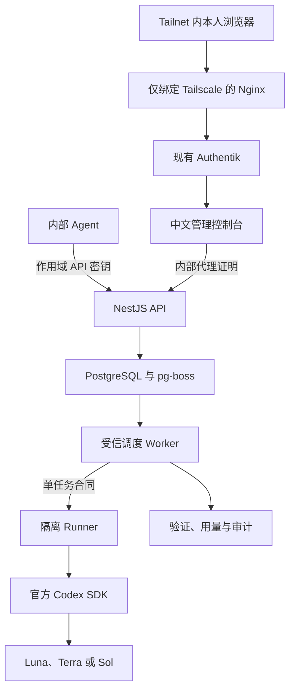
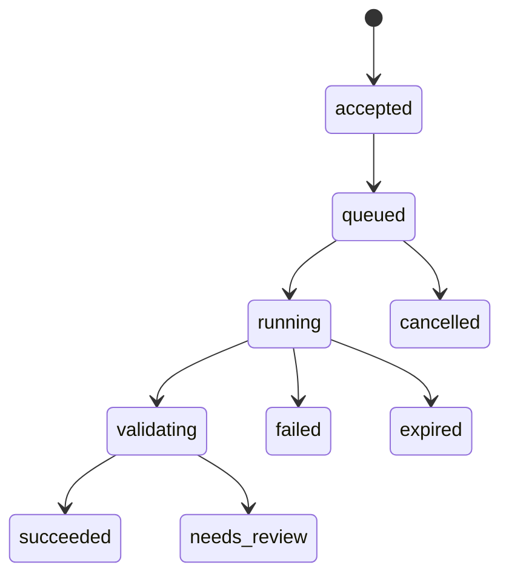

# 1 AIALRA Model Router 架构

## 1.1 系统边界

图 1.1 系统主流程

所有入口先受 Tailnet 限制。根路径直接进入 Authentik，机器接口再使用独立 API 密钥。

浏览器身份依次通过 Router 专用 Group、Nginx→Web 边缘证明和 Web→API 内部证明。API 与 Worker 没有 Codex 登录目录；只有隔离 Runner 挂载该目录。Runner 没有数据库、正文主密钥或容器套接字。

## 1.2 单仓库

| 目录                   | 职责                                           |
| ---------------------- | ---------------------------------------------- |
| `apps/api`             | 身份、Responses、Jobs、治理与 OpenAPI          |
| `apps/worker`          | 受信队列消费、Runner 调度、验证与保留          |
| `apps/runner`          | 无数据库凭据的隔离 Codex 调用与额度读取        |
| `apps/web`             | 中文公开站点、本地 Passkey 和 Authentik 控制台 |
| `apps/mcp`             | 五个 Agent 委派工具                            |
| `apps/cli`             | 调用、批次、任务、取消、评测与额度命令         |
| `packages/contracts`   | Zod 任务合同与公共类型                         |
| `packages/router`      | 版本化确定性路由状态机                         |
| `packages/providers`   | Codex SDK 与 App Server 额度适配               |
| `packages/persistence` | PostgreSQL、加密载荷、身份与审计               |
| `packages/security`    | HMAC、AES-256-GCM、扫描与脱敏                  |
| `packages/client`      | OpenAPI 生成类型与 TypeScript 客户端           |

## 1.3 状态与路由

接单时固定一个 Codex 模型和一个推理等级。首个输出后不切换模型；同模型只允许一次瞬时故障重试。

首版拒绝联网任务和 `sessionKey`。这是安全收口，不是静默降级。

## 1.4 设计记录

- [ADR 0001：确定性粘性路由](docs/adr/0001-deterministic-sticky-routing.md)
- [ADR 0002：PostgreSQL 持久队列](docs/adr/0002-postgres-persistent-queue.md)
- [威胁模型](docs/threat-model.md)
- [VPS 部署](docs/deployment.md)
- [评测方法](docs/evaluation.md)
