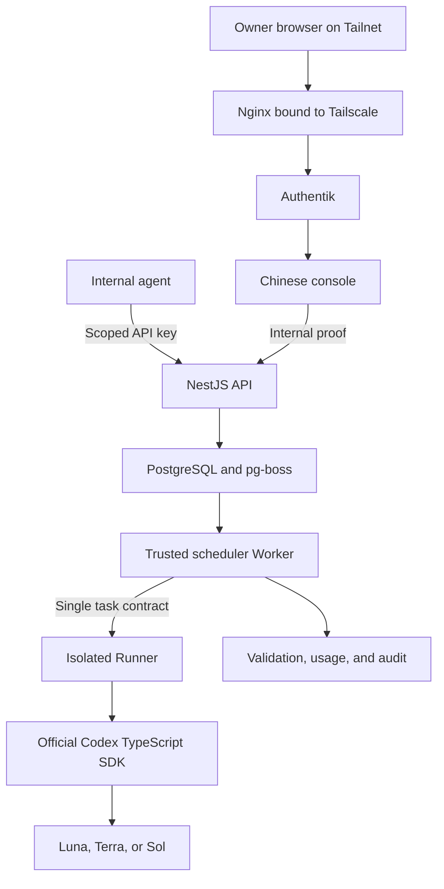

<div align="center">

# AIALRA Model Router

A Codex-only private task router for an account owner's devices and internal agents

`Responses subset` · `durable Jobs` · `Luna / Terra / Sol` · `MCP` · `Chinese console`

Status: `0.1.0 private prerelease`　License: `Apache-2.0`　Scope: owner devices and internal AIALRA automation

[中文](README.md) · [English](README.en.md) · [Usage](docs/usage.md) · [Deployment](docs/deployment.md) · [Security](SECURITY.md)

The deployed root goes directly to Authentik sign-in; examples use `https://router.example.com`


Figure 1. Chinese console rendered with synthetic jobs and quota only.

</div>

## 1 Project scope

AIALRA Model Router connects a logged-in Codex executor to a private control plane. Browsers, scripts, and internal agents submit work through one interface and pin each task to Luna, Terra, or Sol.

The repository executes Codex only. It contains no alternate-provider adapter, credential, routing branch, or cost ledger.

The first release includes a Responses subset, durable Jobs, deterministic model routing, quota guards, a CLI, MCP tools, a TypeScript client, Authentik browser login, scoped API keys, PostgreSQL queueing, encrypted payloads, audit, and deletion receipts.

This is not an official OpenAI project, an OpenAI API service, a subscription resale service, or a multi-provider gateway. OpenAI, Codex, and related marks belong to their respective owners.

## 2 User entry points

| Entry         | Address or command           | Purpose                            | Authentication |
| ------------- | ---------------------------- | ---------------------------------- | -------------- |
| Sign-in       | `/`                          | Go directly to the private console | Authentik      |
| Internal docs | `/docs`                      | Quickstart, contracts, errors      | Authentik      |
| Console       | `/console`                   | Invoke, jobs, quota, keys, audit   | Authentik      |
| Responses     | `POST /v1/responses`         | Model-style text calls             | API key        |
| Jobs          | `POST /api/v1/jobs`          | Long work, batches, events         | API key        |
| OpenAPI       | `/openapi`, `/openapi.json`  | HTTP contract                      | Tailnet        |
| CLI           | `node apps/cli/dist/main.js` | Shell and pipelines                | API key        |
| MCP           | `node apps/mcp/dist/main.js` | Agent delegation                   | API key        |

Nginx and Authentik protect browser access. Next.js uses a separate internal proof when it calls NestJS. External agents use scoped, rate-limited, expiring, revocable API keys.

## 3 Local run

Install Node.js 22, pnpm 10, Docker Compose, and prepare a dedicated Codex login directory.

```powershell
pnpm install
codex login status
pwsh ./deploy/scripts/prepare-local.ps1
docker compose --env-file ./deploy/local.env -f ./deploy/compose.yaml --profile codex up --build -d
docker compose --env-file ./deploy/local.env -f ./deploy/compose.yaml --profile codex ps
```

Open `http://localhost:13211/setup`, register a passkey with the one-time local bootstrap token, then use `/console/playground`. Local mode uses a passkey so Authentik is not required; VPS production uses the existing Authentik service.

## 4 API examples

### 4.1 Responses request

```powershell
$RouterUrl = "https://router.example.com"
$Headers = @{
  Authorization = "Bearer $env:MODEL_ROUTER_API_KEY"
  "Idempotency-Key" = [guid]::NewGuid().ToString()
}
$Body = @{
  model = "luna"
  input = "Summarize this synthetic alert in three points"
  reasoning = @{ effort = "low" }
} | ConvertTo-Json -Depth 6
Invoke-RestMethod -Method Post -Uri "$RouterUrl/v1/responses" -Headers $Headers -ContentType "application/json" -Body $Body
```

The result includes the effective model, output, state, job ID, and Codex Credits. Unsupported fields return `400 unsupported_parameter`.

### 4.2 JSON Schema request

Set `text.format.type` to `json_schema`, provide `name`, `schema`, and `strict`, then send the same `/v1/responses` request. Validation failure enters `needs_review` rather than changing models automatically.

### 4.3 Durable Jobs request

```powershell
$Body = @{
  task = @{
    objective = "Review synthetic TypeScript and report only provable issues"
    taskKind = "review"
    model = "auto"
    effort = "medium"
    permissions = @{ filesystem = "read"; network = "none" }
  }
} | ConvertTo-Json -Depth 8
$Job = Invoke-RestMethod -Method Post -Uri "$RouterUrl/api/v1/jobs" -Headers $Headers -ContentType "application/json" -Body $Body
Invoke-RestMethod -Method Get -Uri "$RouterUrl/api/v1/jobs/$($Job.id)" -Headers @{ Authorization = $Headers.Authorization }
```

States advance through `accepted → queued → running → validating`; terminal states are `succeeded | needs_review | failed | cancelled | expired`.

## 5 Programmatic access

```powershell
$env:MODEL_ROUTER_URL = "https://router.example.com"
$env:MODEL_ROUTER_API_KEY = "<set in a secure terminal>"
pnpm build
node apps/cli/dist/main.js call --task "Return only OK" --kind bounded --model luna --effort low
node apps/cli/dist/main.js jobs --limit 20
node apps/cli/dist/main.js quota
```

MCP exposes `delegate_codex`, `preview_route`, `job_status`, `cancel_job`, and `quota_snapshot`. Delegation depth is one.

```typescript
import { ModelRouterClient } from "@aialra/model-router-client";

const client = new ModelRouterClient({
  baseUrl: process.env.MODEL_ROUTER_URL!,
  apiKey: process.env.MODEL_ROUTER_API_KEY!,
});
const result = await client.createResponse({ model: "luna", input: "Return only OK" });
```

## 6 Architecture



Admission pins one model and reasoning effort for the task lifetime.

| Task shape                                      | Default model | Typical work                                            |
| ----------------------------------------------- | ------------- | ------------------------------------------------------- |
| Bounded, structured, automatically verifiable   | Luna          | Classification, extraction, conversion, short summaries |
| Everyday coding, debugging, integration, review | Terra         | Fixes, reviews, and integration work                    |
| Ambiguous, high-risk, or disputed               | Sol           | Architecture, threat analysis, complex planning         |

## 7 Security boundaries

- The trusted scheduling Worker owns database and payload-key access but never executes Codex tasks.
- The isolated Runner receives one contract, an ephemeral workspace, and the Codex identity mount; it receives no database or payload key.
- Sandbox policy denies the root filesystem, `/run/secrets`, process environments, and the Codex identity directory.
- The first release rejects networked tasks until a domain-enforcing egress proxy is verified.
- Secure-cleanup mode rejects `sessionKey` and removes Codex session files after each job.
- Defaults are read-only, offline, and 120 seconds; writes need an explicit contract and approval.
- API keys store only a fixed prefix and HMAC-SHA-256 digest; defaults are 30 days and 60 requests/minute, with idempotent confirmed create and revoke operations.
- Per-record AES-256-GCM binds the Job ID, field, and version as AAD; payloads expire after 24 hours and metadata after 90 days.
- A Router-specific Authentik group plus independent Nginx→Web and Web→API proofs protect browser identity.

See the [threat model](docs/threat-model.md).

## 8 VPS deployment

Production reuses Docker Compose, Tailscale, Nginx, Authentik, and Cloudflare DNS:

1. Prepare the dedicated account and root-only secrets.
2. Build and start PostgreSQL, API, and Web with job admission disabled.
3. Create a DNS-only AAAA record for the Tailscale IPv6 address, obtain the certificate with DNS-01, register the Authentik application, render a Tailscale-bound Nginx server, and run `nginx -t`.
4. Complete a fresh dedicated Codex login and Linux isolation canary.
5. Start the isolated Runner and trusted Worker, then open admission only after attack probes and health checks succeed.

See the [deployment guide](docs/deployment.md). Templates use `router.example.com`; real infrastructure values do not enter the public repository.

## 9 Repository map

```text
apps/api        # NestJS control plane, Responses, Jobs
apps/web        # Next.js Chinese site and console
apps/worker     # Trusted scheduler with database and payload-key access
apps/runner     # Isolated Codex executor without database credentials
apps/cli        # Command-line client
apps/mcp        # MCP tools
packages        # Contracts, routing, persistence, security, provider, client
openapi         # Sole HTTP contract
deploy          # Compose, Nginx, DNS, backup, deployment scripts
skill           # Reusable router skill
evals           # Anonymous evaluation fixtures
```

## 10 Verification

```powershell
pnpm check
```

Automated coverage includes routing, caller authorization, key idempotency, Authentik groups and proofs, AAD encryption, retention, Runner environment filtering, Worker output scanning, Responses errors, and the Chinese Web build. The 2026-08-26 VPS baseline confirmed that:

- the dedicated Codex Worker can invoke Luna with ChatGPT authentication;
- regular Responses, SSE, JSON Schema, Jobs, events, and same-key idempotent replay succeed;
- the former Codex sandbox could not read its authentication file or resolve an external domain; the new Worker/Runner boundary must pass fresh attack probes before admission reopens;
- an unauthenticated console request redirects to Authentik while the public Chinese site returns 200;
- an encrypted PostgreSQL backup can be read by tools from the matching major version.

Formal public-release gates still include the 30/150-task evaluations, concurrency 1→2→4, a 24-hour soak, a complete restore drill, and final-image SBOMs. The GitHub repository remains private; the old-history gate is still `incomplete`, and no publishable single-root copy exists yet. See [implementation status](docs/implementation-status.md).

## 11 Reuse

OpenAPI is the sole HTTP contract and generates the client. Hostnames, credentials, certificates, and Authentik inventory are injected at deployment and never committed.

See [CONTRIBUTING.md](CONTRIBUTING.md) and report vulnerabilities privately through [SECURITY.md](SECURITY.md).

## 12 License record

The repository uses [Apache-2.0](LICENSE). Third-party and clean-room records are in [THIRD_PARTY_NOTICES](THIRD_PARTY_NOTICES). The owner approved the license record for publication; that is not legal advice on trademarks, subscription terms, or patents.

A bounded prior-art review found the differentiated combination to be Codex-only task contracts, deterministic model selection, quota thresholds, two-hop Authentik proof, result validation, and reproducible evaluation. No “first” or “only” claim is made.
