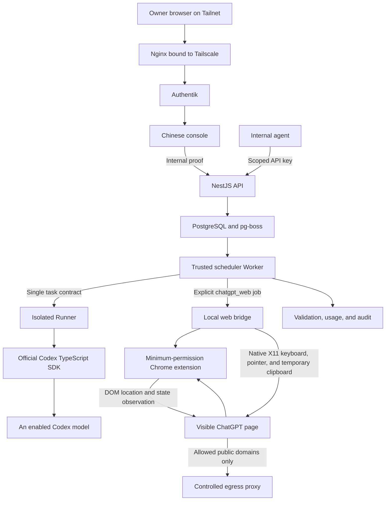

<div align="center">

<h1 align="center">AIALRA Model Router</h1>

A private subscription-capacity router for an account owner's devices and internal agents

`Codex stable channel` · `ChatGPT web experiment` · `durable Jobs` · `MCP` · `Chinese console`

Status: `0.1.0 prerelease`　License: `Apache-2.0`　Scope: owner devices and internal automation

[中文](README.md) · [English](README.en.md) · [Usage](docs/usage.md) · [Deployment](docs/deployment.md) · [Security](SECURITY.md)

The deployed root goes directly to Authentik sign-in; examples use `https://router.example.com`


Figure 1. Chinese console rendered with synthetic jobs and quota only.

</div>

## 1 Project scope

AIALRA Model Router connects a logged-in Codex executor to a private control plane. Browsers, scripts, and internal agents submit work through one interface and pin each task to one execution channel and model. Automatic Codex routing remains limited to the calibrated Luna, Terra, and Sol set.

The default stable channel uses only the official Codex CLI, TypeScript SDK, and App Server.

The repository also contains a disabled-by-default, clean-room “ChatGPT Pro web experimental channel.” A dedicated visible Chromium instance uses a minimum-permission extension and semantic DOM operations. An administrator signs in and handles verification through noVNC. The implementation does not request cookie access, call private `backend-api` endpoints, intercept site SSE, expose remote debugging, or bypass verification.

The web experiment includes a warm tab pool, DOM location and observation, container-local native keyboard and pointer input, ten-minute failure quarantine, a restart-safe submission journal, a dedicated Chromium sandbox, persisted circuit state, and adaptive concurrency from one to four. `GET /api/v1/chatgpt-web/status` exposes only secret-free sandbox, sign-in, slot, queue, concurrency, circuit, and qualification fields; admission remains closed until the real-page gate passes.

The experiment is not an official API, depends on the ChatGPT UI, and can stop working without notice. Personal or non-profit use does not automatically remove terms risk. Read the [experimental channel guide](docs/chatgpt-web-experiment.en.md) before enabling it.

The first release includes a Responses subset, an OpenAI Chat Completions compatibility endpoint, resumable multi-turn conversation threads, durable Jobs, deterministic model routing, quota guards, a CLI, MCP tools, a TypeScript client, Authentik browser login, scoped API keys, PostgreSQL queueing, encrypted payloads, audit, and deletion receipts.

This is not an official OpenAI project, an OpenAI API service, a subscription resale service, or a multi-account sharing service. OpenAI, ChatGPT, Codex, and related marks belong to their respective owners.

## 2 User entry points

| Entry           | Address or command           | Purpose                              | Authentication      |
| --------------- | ---------------------------- | ------------------------------------ | ------------------- |
| Sign-in         | `/`                          | Go directly to the private console   | Authentik           |
| Internal docs   | `/docs`                      | Quickstart, contracts, errors        | Authentik           |
| Console         | `/console`                   | Invoke, jobs, quota, keys, audit     | Authentik           |
| Responses       | `POST /v1/responses`         | Model-style text calls               | API key             |
| Chat            | `POST /v1/chat/completions`  | OpenAI-compatible chat calls         | API key             |
| Threads         | `GET /api/v1/threads`        | Resumable conversation threads       | API key             |
| Jobs            | `POST /api/v1/jobs`          | Long work, batches, events           | API key             |
| OpenAPI         | `/openapi`, `/openapi.json`  | HTTP contract                        | Tailnet             |
| CLI             | `node apps/cli/dist/main.js` | Shell and pipelines                  | API key             |
| MCP             | `node apps/mcp/dist/main.js` | Agent delegation                     | API key             |
| Visible browser | `/chatgpt-browser/`          | Manual ChatGPT sign-in and diagnosis | Tailnet + Authentik |

Nginx and Authentik protect browser access. Next.js uses a separate internal proof when it calls NestJS. External agents use scoped, rate-limited, expiring, revocable API keys.

## 3 Local run

Install Node.js 22, pnpm 10, Docker Compose, and prepare a dedicated Codex login directory.

```powershell
pnpm install
codex login status
pwsh ./deploy/scripts/prepare-local.ps1
docker compose --env-file ./deploy/local.env -f ./deploy/compose.yaml --profile codex up --build -d
docker compose --env-file ./deploy/local.env -f ./deploy/compose.yaml --profile codex ps
```

Open `http://localhost:13211/setup`, register a passkey with the one-time local bootstrap token, then use `/console/playground`. Local mode uses a passkey so Authentik is not required; VPS production uses the existing Authentik service.

## 4 API examples

### 4.1 Responses request

```powershell
$RouterUrl = "https://router.example.com"
$Headers = @{
  Authorization = "Bearer $env:MODEL_ROUTER_API_KEY"
  "Idempotency-Key" = [guid]::NewGuid().ToString()
}
$Body = @{
  model = "luna"
  input = "Summarize this synthetic alert in three points"
  reasoning = @{ effort = "low" }
} | ConvertTo-Json -Depth 6
Invoke-RestMethod -Method Post -Uri "$RouterUrl/v1/responses" -Headers $Headers -ContentType "application/json" -Body $Body
```

The result includes the effective model, output, state, job ID, and Codex Credits. Unsupported fields return `400 unsupported_parameter`.

### 4.2 JSON Schema request

Set `text.format.type` to `json_schema`, provide `name`, `schema`, and `strict`, then send the same `/v1/responses` request. A validation mismatch returns `failed` with `validation_failed` and never changes models automatically.

### 4.3 Durable Jobs request

```powershell
$Body = @{
  task = @{
    objective = "Review synthetic TypeScript and report only provable issues"
    taskKind = "review"
    model = "auto"
    effort = "medium"
    permissions = @{ preset = "restricted" }
  }
} | ConvertTo-Json -Depth 8
$Job = Invoke-RestMethod -Method Post -Uri "$RouterUrl/api/v1/jobs" -Headers $Headers -ContentType "application/json" -Body $Body
Invoke-RestMethod -Method Get -Uri "$RouterUrl/api/v1/jobs/$($Job.id)" -Headers @{ Authorization = $Headers.Authorization }
```

Normal calls advance through `accepted → queued → running → validating`; terminal states are `succeeded | failed | cancelled | expired`. Only `confirm` calls enter `awaiting_approval` before queueing.

### 4.4 Multi-turn conversations

Calls are one-shot by default and the session file is deleted right after execution. Set `session_mode: "persistent"` in the `aialra` namespace on the first turn; the success response carries `metadata.session_key`. Later turns pass `aialra.session_key` to resume the same Codex thread, pinned to the first turn's model and effort. Threads expire after 24 hours by default (`SESSION_THREAD_TTL_MS`), unknown or expired threads return `409 session_expired`, and another caller's thread returns `403 session_access_denied`. Session files stay in the Runner's Codex home and are reaped on a schedule (`CODEX_SESSION_TTL_MS`); they never enter the database or backups. The native Jobs contract exposes the same capability as `sessionMode` and `sessionKey`.

### 4.5 Chat Completions compatibility

`POST /v1/chat/completions` accepts the standard OpenAI request body, so any official SDK works by only changing `base_url` and the key. Supported fields: `messages`, `stream`, `stream_options.include_usage`, `max_tokens`, `max_completion_tokens`, `response_format` (`text`, `json_object`, `json_schema`), `reasoning_effort`, `metadata`, and the `aialra` extension namespace. The Idempotency-Key header is optional here. Unsupported fields return `400 unsupported_parameter`; if the call is still running when the wait budget ends, the endpoint returns `504 gateway_timeout` with the job id for polling via the Jobs API.

### 4.6 ChatGPT Pro web experimental channel

After an administrator signs in through the protected visible browser and enables a discovered web model, callers must select the experimental channel explicitly:

```powershell
$WebBody = @{
  model = "chatgpt-web.auto"
  input = "Research a synthetic topic and list public sources"
  aialra = @{
    execution_channel = "chatgpt_web"
    chatgpt_mode = "search"
    require_sources = $true
  }
} | ConvertTo-Json -Depth 8
Invoke-RestMethod -Method Post -Uri "$RouterUrl/v1/responses" -Headers $Headers -ContentType "application/json" -Body $WebBody
```

Non-streaming requests wait for the final body. Streaming requests emit state and one final complete body rather than fabricated token deltas. The page does not expose reliable tokens, Credits, quota deltas, or API-equivalent prices, so the response uses `measurementStatus: "unavailable"` and the console never presents zero as a measurement.

Search defaults to ten minutes and deep research to sixty minutes. Use Jobs for long work. See the [experimental channel guide](docs/chatgpt-web-experiment.en.md) for enablement, sign-in, errors, security boundaries, and probe gates.

The protected “ChatGPT web channel” console page can run the read-only check, three-chat gate, two-deep-research gate, or complete ten-job gate. The corresponding API endpoints are `POST /api/v1/chatgpt-web/qualification-runs` and `GET /api/v1/chatgpt-web/qualification-runs/{id}`. Records contain only stage, duration, length, digest, source count, and error class; prompts, answers, accounts, and conversation URLs are excluded.

## 5 Programmatic access

```powershell
$env:MODEL_ROUTER_URL = "https://router.example.com"
$env:MODEL_ROUTER_API_KEY = "<set in a secure terminal>"
pnpm build
node apps/cli/dist/main.js call --task "Return only OK" --kind bounded --model luna --effort low --permission restricted
node apps/cli/dist/main.js chat --message "Return only OK" --model luna
node apps/cli/dist/main.js research --task "Research a synthetic topic" --mode search --model chatgpt-web.auto
node apps/cli/dist/main.js call --task "Remember the number 42" --session persistent
node apps/cli/dist/main.js chat --message "What was the number?" --session-key <thread>
node apps/cli/dist/main.js threads
node apps/cli/dist/main.js jobs --limit 20
node apps/cli/dist/main.js quota
```

MCP exposes `delegate_codex`, `delegate_chatgpt`, `preview_route`, `job_status`, `cancel_job`, and `quota_snapshot`. Delegation depth is one and web jobs cannot delegate again.

```typescript
import { ModelRouterClient } from "@aialra/model-router-client";

const client = new ModelRouterClient({
  baseUrl: process.env.MODEL_ROUTER_URL!,
  apiKey: process.env.MODEL_ROUTER_API_KEY!,
});
const result = await client.createResponse({ model: "luna", input: "Return only OK" });
```

## 6 Architecture



Admission pins one model and reasoning effort for the task lifetime.

| Task shape                                      | Default model | Typical work                                            |
| ----------------------------------------------- | ------------- | ------------------------------------------------------- |
| Bounded, structured, automatically verifiable   | Luna          | Classification, extraction, conversion, short summaries |
| Everyday coding, debugging, integration, review | Terra         | Fixes, reviews, and integration work                    |
| Ambiguous, high-risk, or disputed               | Sol           | Architecture, threat analysis, complex planning         |

## 7 Security boundaries

- The trusted scheduling Worker owns database and payload-key access but never executes Codex tasks.
- The isolated Runner receives one contract, an ephemeral workspace, and the Codex identity mount; it receives no database or payload key.
- Sandbox policy denies the root filesystem, `/run/secrets`, process environments, and the Codex identity directory.
- `restricted` disables networking. `full` permits public Internet access while host egress rules block loopback, private, Tailnet, cloud-metadata, and other Docker destinations.
- Secure-cleanup mode rejects `sessionKey` and removes Codex session files after each job.
- Defaults are read-only, offline, and 120 seconds; writes need an explicit contract and approval.
- API keys store only a fixed prefix and HMAC-SHA-256 digest; defaults are 30 days and 60 requests/minute, with idempotent confirmed create and revoke operations.
- Per-record AES-256-GCM binds the Job ID, field, and version as AAD; payloads expire after 24 hours and metadata after 90 days.
- A Router-specific Authentik group plus independent Nginx→Web and Web→API proofs protect browser identity.
- The web experiment uses a separate browser account and persistent profile volume. Treat that volume as a login credential and exclude it from ordinary backups.
- The browser receives no database, payload key, Codex login, container socket, or host directory. A domain allowlist proxy is its only public egress path.
- The extension requests no cookie, clipboard, download, or all-sites permission, exposes no CDP port, and pauses for manual handling when verification appears.
- Prompt text exists briefly only in the isolated browser container's X11 clipboard. The DOM verifies the editor character-for-character and then clears the clipboard; the text is not written to extension storage, logs, or qualification records.
- Extension storage keeps only a job-id digest, slot id, document id, stage, and submitted flag. After a browser restart, an already-submitted job without a terminal result fails rather than being sent again.

See the [threat model](docs/threat-model.md).

## 8 VPS deployment

Production reuses Docker Compose, Tailscale, Nginx, Authentik, and Cloudflare DNS:

1. Prepare the dedicated account and root-only secrets.
2. Build and start PostgreSQL, API, and Web with job admission disabled.
3. Create a DNS-only AAAA record for the Tailscale IPv6 address, obtain the certificate with DNS-01, register the Authentik application, render a Tailscale-bound Nginx server, and run `nginx -t`.
4. Complete a fresh dedicated Codex login and Linux isolation canary.
5. Start the isolated Runner and trusted Worker, then open admission only after attack probes and health checks succeed.
6. Optionally run `enable-chatgpt-web.sh` with `ACTION=start`, sign in through protected noVNC, complete the ten-task probe, then run it with `ACTION=enable`.

See the [deployment guide](docs/deployment.md). Templates use `router.example.com`; real infrastructure values do not enter the public repository.

## 9 Repository map

```text
apps/api        # NestJS control plane, Responses, Jobs
apps/web        # Next.js Chinese site and console
apps/worker     # Trusted scheduler with database and payload-key access
apps/runner     # Isolated Codex executor without database credentials
apps/cli        # Command-line client
apps/mcp        # MCP tools
apps/chatgpt-bridge # Disabled-by-default bridge and minimum-permission extension
packages        # Contracts, routing, persistence, security, provider, client
openapi         # Sole HTTP contract
deploy          # Compose, Nginx, DNS, backup, deployment scripts
skill           # Reusable router skill
evals           # Anonymous evaluation fixtures
```

## 10 Verification

```powershell
pnpm check
```

Automated checks cover routing, caller authorization, key idempotency, Authentik groups and proofs, AAD encryption, retention, Runner environment filtering, Worker output scanning, Responses errors, bridge protocol, and a synthetic DOM contract.

This change passed synthetic model discovery, extension authentication, single-send protection, complete-output stabilization, and source extraction. The ten real ChatGPT page probes have not run, so the web experiment remains disabled by default.

The 2026-08-26 VPS baseline confirmed that:

- the dedicated Codex Worker can invoke Luna with ChatGPT authentication;
- regular Responses, SSE, JSON Schema, Jobs, events, and same-key idempotent replay succeed;
- the former Codex sandbox could not read its authentication file or resolve an external domain; the new Worker/Runner boundary must pass fresh attack probes before admission reopens;
- an unauthenticated console request redirects to Authentik while the public Chinese site returns 200;
- an encrypted PostgreSQL backup can be read by tools from the matching major version.

Formal release gates still include the 30/150-task evaluations, concurrency 1→2→4, a 24-hour soak, a complete restore drill, and final-image SBOMs. The source repository is public while production access stays private to the Tailnet. Experimental code does not mean the channel is enabled in production. See [implementation status](docs/implementation-status.md).

## 11 Reuse

OpenAPI is the sole HTTP contract and generates the client. Hostnames, credentials, certificates, and Authentik inventory are injected at deployment and never committed.

See [CONTRIBUTING.md](CONTRIBUTING.md) and report vulnerabilities privately through [SECURITY.md](SECURITY.md).

## 12 License record

The repository uses [Apache-2.0](LICENSE). Third-party and clean-room records are in [THIRD_PARTY_NOTICES](THIRD_PARTY_NOTICES). The owner approved the license record for publication; that is not legal advice on trademarks, subscription terms, or patents.

A bounded prior-art review found the differentiated combination to be a shared task contract, deterministic Codex routing, a disabled-by-default visible-web experiment, two-hop Authentik proof, result validation, and reproducible evaluation. No “first” or “only” claim is made.
