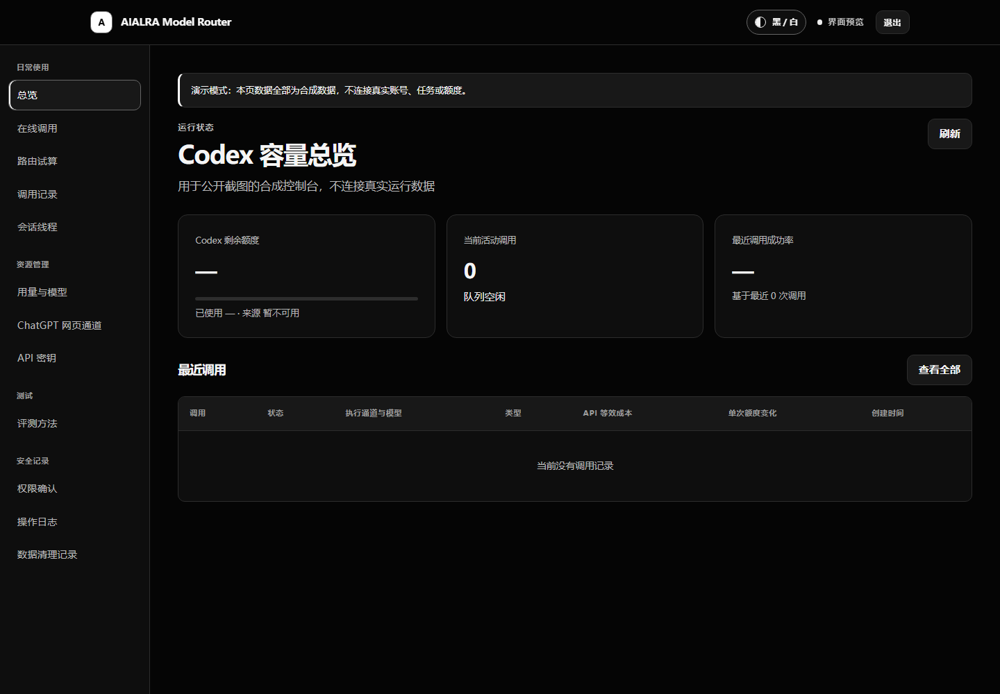
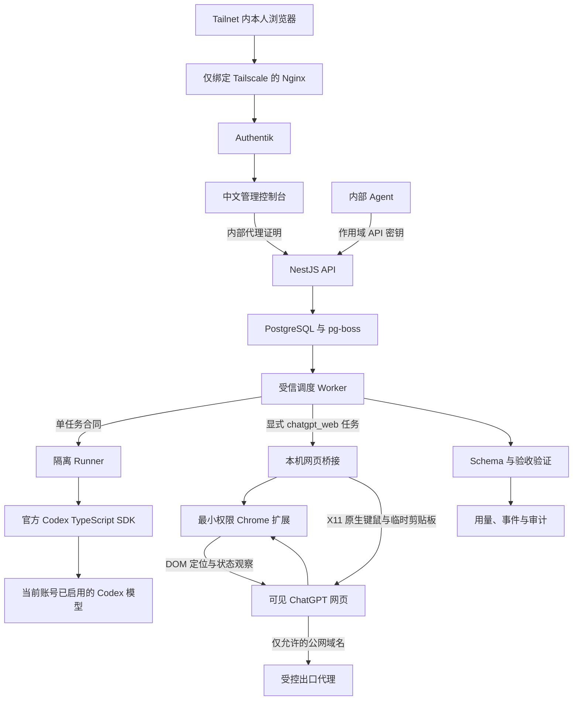

<div align="center">

<h1 align="center">AIALRA Model Router</h1>

面向账户所有者个人设备与内部 Agent 的私有订阅容量路由器

`Codex 稳定通道` · `ChatGPT 网页实验通道` · `持久 Jobs` · `MCP` · `中文控制台`

状态：`0.1.0 预发布`　许可：`Apache-2.0`　范围：本人设备与内部自动化

[中文](README.md) · [English](README.en.md) · [使用指南](docs/usage.md) · [部署指南](docs/deployment.md) · [安全政策](SECURITY.md)

部署后的根路径直接进入 Authentik 登录，示例地址使用 `https://router.example.com`



图 1　使用合成任务和合成额度生成的中文控制台；不含真实账号、任务、路径或内部编号

</div>

## 1 项目定位

AIALRA Model Router 把已经登录的 Codex 执行器接到一个私有控制面，网页、脚本和内部 Agent 可以通过统一接口提交任务，并在接单时固定执行通道和模型

默认稳定通道只使用官方 Codex CLI、TypeScript SDK 和 App Server

仓库另含默认关闭的“ChatGPT Pro 网页实验通道” clean-room 实现：专用可见 Chromium 通过最小权限扩展操作语义化 DOM，管理员在 noVNC 中手动登录和处理验证页面，系统不申请 Cookie 权限、不调用私有 `backend-api`、不拦截站点 SSE、不开放远程调试端口，也不绕过验证码

网页实验通道不是官方 API，依赖 ChatGPT 页面结构并可能随时失效，个人或非盈利使用不会自动消除服务条款风险，启用前请先阅读[实验通道说明](docs/chatgpt-web-experiment.md)

首版提供：

- 中文私有管理控制台与仓库内使用文档
- `POST /v1/responses` 的文本、JSON Schema 和流式响应子集
- `POST /v1/chat/completions` 的 Chat Completions 兼容调用，标准 OpenAI SDK 只需更换 `base_url`
- 可续聊的多轮会话：保留会话线程并用 `sessionKey` 继续，线程在控制台可见
- 持久 Jobs、批次、状态事件、取消、验证和幂等
- 确定性的 Luna、Terra、Sol 路由与 Codex 额度水位保护
- CLI、MCP 和 TypeScript 客户端
- 默认关闭的 ChatGPT Pro 可见网页实验通道、预热标签池和受控域名出口
- DOM 定位与观察、容器内原生键鼠输入、十分钟失败隔离和防重复提交日志
- 网页通道专用 Chromium 沙箱、脱敏验收记录、熔断状态、固定并发 `1` 和 90 秒最短提交间隔
- Authentik 浏览器登录与作用域 API 密钥
- PostgreSQL 队列、加密正文、审计和删除回执

这不是 OpenAI 官方项目，也不是 OpenAI API 服务、订阅转售服务或多账号共享服务，OpenAI、ChatGPT、Codex 及相关标识归其权利人所有

## 2 用户入口

| 入口       | 地址或命令                   | 用途                             | 身份验证            |
| ---------- | ---------------------------- | -------------------------------- | ------------------- |
| 登录入口   | `/`                          | 直接进入私有控制台登录           | Authentik           |
| 内部文档   | `/docs`                      | 快速开始、契约和错误码           | Authentik           |
| 管理控制台 | `/console`                   | 在线调用、任务、额度、密钥和审计 | Authentik           |
| Responses  | `POST /v1/responses`         | 迁移模型式文本调用               | API 密钥            |
| Chat       | `POST /v1/chat/completions`  | OpenAI 兼容聊天调用              | API 密钥            |
| Threads    | `GET /api/v1/threads`        | 可续聊的会话线程清单             | API 密钥            |
| Jobs       | `POST /api/v1/jobs`          | 长任务、批次和事件               | API 密钥            |
| OpenAPI    | `/openapi`、`/openapi.json`  | HTTP 契约                        | Tailnet             |
| CLI        | `node apps/cli/dist/main.js` | PowerShell 与流水线              | API 密钥            |
| MCP        | `node apps/mcp/dist/main.js` | Agent 委派                       | API 密钥            |
| 可见浏览器 | `/chatgpt-browser/`          | ChatGPT 手动登录、验证与诊断     | Tailnet + Authentik |

生产环境中，Nginx 先让 Authentik 验证浏览器，再把受保护身份交给 Next.js；Next.js 使用另一份内部证明调用 NestJS；外部 Agent 不经过浏览器登录，只使用有范围、有限速、可到期和可吊销的 API 密钥

## 3 本地运行

需要 Node.js 22、pnpm 10、Docker Compose 和一个专用的 Codex 登录目录

```powershell
pnpm install # 安装单仓库依赖
codex login status # 确认当前专用 Codex 登录有效
pwsh ./deploy/scripts/prepare-local.ps1 # 生成本地数据库、加密和认证密钥
docker compose --env-file ./deploy/local.env -f ./deploy/compose.yaml --profile codex up --build -d # 启动数据库、API、中文网页和 Worker
docker compose --env-file ./deploy/local.env -f ./deploy/compose.yaml --profile codex ps # 核对健康状态
```

首次本地使用：

1. 打开 `http://localhost:13211/setup`
2. 从 `deploy/secrets/bootstrap_admin_token` 读取一次性 Token
3. 注册 Passkey，并把恢复码离线保存
4. 打开 `http://localhost:13211/console/playground` 提交任务
5. 在 `http://localhost:13211/console/keys` 创建 Agent API 密钥；明文只显示一次

本地使用 Passkey 是为了无需安装 Authentik；VPS 生产入口使用既有 Authentik

## 4 API 调用案例

### 4.1 Responses 调用

```powershell
$RouterUrl = "https://router.example.com" # 替换为部署者提供的 HTTPS 地址
$Headers = @{
  Authorization = "Bearer $env:MODEL_ROUTER_API_KEY" # 从当前进程读取一次显示的密钥
  "Idempotency-Key" = [guid]::NewGuid().ToString() # 重试同一请求时复用原值
}
$Body = @{
  model = "luna" # 可选 auto、luna、terra、sol
  input = "把这条合成告警归纳成 3 个要点"
  reasoning = @{ effort = "low" }
} | ConvertTo-Json -Depth 6
Invoke-RestMethod -Method Post -Uri "$RouterUrl/v1/responses" -Headers $Headers -ContentType "application/json" -Body $Body
```

成功结果包含实际模型、输出、状态、内部任务编号和独立的 Codex Credits 用量；未支持的 Responses 字段返回 `400 unsupported_parameter`，不会静默忽略

### 4.2 JSON Schema 调用

```powershell
$Schema = @{
  type = "object"
  properties = @{
    category = @{ type = "string"; enum = @("通知", "行动项", "垃圾信息") }
    confidence = @{ type = "number"; minimum = 0; maximum = 1 }
  }
  required = @("category", "confidence")
  additionalProperties = $false
}
$Body = @{
  model = "luna"
  input = "证书将在三天后到期，请安排续期"
  text = @{ format = @{ type = "json_schema"; name = "classification"; schema = $Schema; strict = $true } }
} | ConvertTo-Json -Depth 12
Invoke-RestMethod -Method Post -Uri "$RouterUrl/v1/responses" -Headers $Headers -ContentType "application/json" -Body $Body
```

### 4.3 持久 Jobs 调用

```powershell
$JobBody = @{
  task = @{
    objective = "审查给定的合成 TypeScript 片段，只列出可证明的问题"
    taskKind = "review"
    model = "auto"
    effort = "medium"
    expectedOutput = "最多返回 3 项问题、证据和修复建议"
    permissions = @{ preset = "restricted" }
    deadlineMs = 120000
  }
} | ConvertTo-Json -Depth 10
$Job = Invoke-RestMethod -Method Post -Uri "$RouterUrl/api/v1/jobs" -Headers $Headers -ContentType "application/json" -Body $JobBody
Invoke-RestMethod -Method Get -Uri "$RouterUrl/api/v1/jobs/$($Job.id)" -Headers @{ Authorization = $Headers.Authorization }
```

普通调用依次为 `accepted → queued → running → validating`，终态为 `succeeded | failed | cancelled | expired`

只有选择 `confirm` 的调用会先进入 `awaiting_approval`，授权后才会排队；模型输出不需要人工决定成功或失败

### 4.4 多轮会话调用

默认每次调用都是一次性的，执行完会话文件立即删除；需要像聊天一样连续多轮对话时，第一轮声明 `sessionMode: "persistent"`，成功后任务会带回 `sessionKey`；后续调用携带同一个 `sessionKey` 即可在原 Codex 线程上继续，模型和推理档位自动粘住第一轮的选择

```powershell
$First = @{
  model = "terra"
  input = "记住这个数字：42；只回复 OK"
  aialra = @{ session_mode = "persistent" }
} | ConvertTo-Json -Depth 6
$FirstResult = Invoke-RestMethod -Method Post -Uri "$RouterUrl/v1/responses" -Headers $Headers -ContentType "application/json" -Body $First
$SessionKey = $FirstResult.metadata.session_key # 第一轮返回的线程标识

$Second = @{
  input = "我刚才让你记住的数字是什么？"
  aialra = @{ session_key = $SessionKey }
} | ConvertTo-Json -Depth 6
Invoke-RestMethod -Method Post -Uri "$RouterUrl/v1/responses" -Headers $Headers -ContentType "application/json" -Body $Second
```

线程默认 24 小时到期（可用 `SESSION_THREAD_TTL_MS` 调整），到期或不存在返回 `409 session_expired`，他人线程返回 `403 session_access_denied`；控制台「会话线程」页可查看线程的模型、轮次和到期时间；会话文件只留在 Runner 的 Codex 目录，由 Runner 定期清理，不进入数据库和备份

### 4.5 Chat Completions 兼容调用

已有工具如果只会说 OpenAI Chat Completions 协议，把 `base_url` 指向 Router 即可直接使用，Idempotency-Key 在此接口可选

```powershell
$ChatBody = @{
  model = "luna"
  messages = @(@{ role = "user"; content = "把这条合成告警归纳成一句话" })
} | ConvertTo-Json -Depth 6
Invoke-RestMethod -Method Post -Uri "$RouterUrl/v1/chat/completions" -Headers @{ Authorization = $Headers.Authorization } -ContentType "application/json" -Body $ChatBody
```

支持 `messages`、`stream`、`stream_options.include_usage`、`max_tokens`、`max_completion_tokens`、`response_format`（text、json_object、json_schema）、`reasoning_effort` 和 `aialra` 扩展命名空间；多轮对话由客户端携带完整消息历史，或用 `aialra.session_key` 续接 Codex 线程；未支持字段返回 `400 unsupported_parameter`；调用仍在执行时返回 `504` 并附带任务编号，可转到 Jobs 接口查询

### 4.6 ChatGPT Pro 网页实验通道

管理员完成专用可见浏览器登录并启用网页模型后，可以通过同一个 Responses 地址显式选择实验通道

```powershell
$WebBody = @{
  model = "chatgpt-web.auto" # 使用网页当前可见的自动模型
  input = "调查一个合成主题并列出公开来源"
  aialra = @{
    execution_channel = "chatgpt_web" # 不会由普通 Codex 调用暗中切换
    chatgpt_mode = "search" # 可选 chat、search、deep_research
    require_sources = $true
  }
} | ConvertTo-Json -Depth 8
Invoke-RestMethod -Method Post -Uri "$RouterUrl/v1/responses" -Headers $Headers -ContentType "application/json" -Body $WebBody
```

非流式调用等待最终正文，流式调用只发送状态和最终完整正文，不伪造逐 Token 输出

网页不提供可靠 Token、Credits、额度变化或 API 等效价格，响应使用 `measurementStatus: "unavailable"`，控制台显示“网页未提供可靠数据”，不会把 `0` 当作实测值

管理员可在控制台“ChatGPT 网页通道”页面查看沙箱、登录、标签池、隔离标签和最近验收状态，也可以运行只读检查、普通聊天 3 次、深度研究 2 次和完整 10 项门禁

对应接口为 `GET /api/v1/chatgpt-web/status`、`POST /api/v1/chatgpt-web/qualification-runs` 和 `GET /api/v1/chatgpt-web/qualification-runs/{id}`；接口只返回阶段、耗时、长度、摘要、来源数和错误分类，不返回提示词、回答、账号或对话地址

搜索默认期限为 10 分钟，深度研究默认期限为 60 分钟，长任务建议使用 Jobs API

启用、登录、错误码、安全边界和探针门槛见[实验通道说明](docs/chatgpt-web-experiment.md)

## 5 程序化调用

```powershell
$env:MODEL_ROUTER_URL = "https://router.example.com"
$env:MODEL_ROUTER_API_KEY = "<在安全终端中设置的密钥>"
pnpm build
node apps/cli/dist/main.js call --task "只返回 OK" --kind bounded --model luna --effort low --permission restricted
node apps/cli/dist/main.js chat --message "只返回 OK" --model luna
node apps/cli/dist/main.js research --task "调查合成主题并列出来源" --mode search --model chatgpt-web.auto
node apps/cli/dist/main.js call --task "记住数字 42" --session persistent # 第一轮保留会话
node apps/cli/dist/main.js chat --message "数字是什么？" --session-key <线程标识> # 继续对话
node apps/cli/dist/main.js threads
node apps/cli/dist/main.js jobs --limit 20
node apps/cli/dist/main.js quota
```

MCP 提供 `delegate_codex`、`delegate_chatgpt`、`preview_route`、`job_status`、`cancel_job` 和 `quota_snapshot`，委派深度固定为 1，网页子任务没有再次委派能力

TypeScript 使用 `ModelRouterClient`：

```typescript
import { ModelRouterClient } from "@aialra/model-router-client";

const client = new ModelRouterClient({
  baseUrl: process.env.MODEL_ROUTER_URL!,
  apiKey: process.env.MODEL_ROUTER_API_KEY!,
});

const result = await client.createResponse({ model: "luna", input: "只返回 OK" });
console.log(result.output);
```

## 6 架构



路由在接单时选定一个模型和推理等级，任务开始输出后不会自动换模型

无验收规则且模型正常返回时状态为 `succeeded`；Schema、`equals` 或 `contains` 检查未通过时状态为 `failed`，错误码为 `validation_failed`

手动调用可选择 App Server 动态发现并由管理员启用的模型；自动路由只使用已校准的 Luna、Terra 和 Sol

| 任务特征                     | 默认模型 | 典型案例                     |
| ---------------------------- | -------- | ---------------------------- |
| 边界清楚、结构化、可自动验证 | Luna     | 分类、抽取、格式转换、短摘要 |
| 日常编码、调试、集成和审查   | Terra    | 修复、审查和集成任务         |
| 高歧义、高风险或分歧裁决     | Sol      | 架构、威胁分析和复杂规划     |

## 7 安全边界

- 受信调度 Worker 持有数据库连接和正文主密钥，但不运行 Codex 子任务
- 隔离 Runner 只获得单项任务合同、一次性工作区和 Codex 身份挂载，不获得数据库、正文主密钥或控制面环境变量
- `restricted` 只读且无网络；`confirm` 在执行前等待授权；`full` 可写本次一次性工作区并访问公开互联网
- `full` 不等于 Codex 的 `danger-full-access`，仍禁止读取 `/run/secrets`、进程环境、Codex 身份目录、宿主机和其他调用工作区
- Authentik 管理员网页会话默认使用 `full`；可信 Agent 密钥可以使用 `full`；普通 API 密钥的上限是 `restricted`
- 安全清理模式不支持 `sessionKey`，并在调用结束后删除 Codex 会话文件
- API 密钥只保存固定前缀与 HMAC-SHA-256 摘要；默认 30 天、60 次/分钟，创建和吊销都要求幂等键与确认
- 任务正文和事件采用带 Job ID、字段名与版本 AAD 的每记录 AES-256-GCM 信封加密；正文与事件 24 小时后删除，脱敏元数据 90 天后删除
- Authentik 身份必须属于 Router 专用组，并同时通过 Nginx→Web 与 Web→API 两份独立证明
- 仓库截图只能使用合成数据，生产根路径直接进入 Authentik
- ChatGPT 网页实验通道使用独立浏览器账户与持久配置卷，配置卷视同登录凭据，不进入普通备份
- 浏览器没有数据库、正文主密钥、Codex 登录、容器套接字或宿主目录，只能通过域名允许清单访问 ChatGPT 所需公网服务
- 扩展不申请 Cookie、剪贴板、下载或全部网站权限，不开放 CDP，出现验证页面时只暂停并等待人工处理
- 提示词只在隔离浏览器容器的 X11 剪贴板中短暂存在；DOM 逐字核对编辑器后立即清空，内容不写入扩展存储、日志或数据库
- 扩展本地只保存任务编号摘要、标签编号、文档编号、阶段和是否已发送；浏览器重启后，已经发送但没有终态的任务直接失败，不会再次发送

详细攻击面和剩余风险见[威胁模型](docs/threat-model.md)

## 8 VPS 部署

生产部署使用现有 Docker Compose、Tailscale、Nginx、Authentik 和 Cloudflare DNS：

1. `prepare-vps.sh` 创建专用账户和目录
2. `prepare-production.sh` 生成 root-only 密钥，默认关闭任务接单
3. `install-compose-release.sh` 构建并启动 PostgreSQL、API 和 Web
4. `upsert-cloudflare-dns.sh` 幂等创建指向 Tailscale IPv6 的 DNS-only AAAA 记录
5. Certbot 使用 Cloudflare DNS challenge 签发证书
6. `register-auth-gateway-app.sh` 注册 Authentik 应用和严格匹配的 OAuth 回调地址，失败时自动恢复原清单
7. `render-nginx.sh` 生成只绑定 Tailscale 接口的 Nginx 配置，`nginx -t` 通过后再重载
8. 专用 `aialra-router` 账户完成 Codex 登录和身份目录隔离探针
9. `enable-codex-worker.sh` 启动隔离 Runner 与唯一受信 Worker，并在攻击探针和健康检查通过后开放接单
10. 可选执行 `ACTION=start enable-chatgpt-web.sh` 启动仍处于关闭状态的可见浏览器，管理员通过受保护 noVNC 登录并完成 10 项探针后，再用 `ACTION=enable` 开放实验通道

完整命令、回滚点和验收清单见[部署指南](docs/deployment.md)；仓库模板使用 `router.example.com`；真实域名和服务器路径不会写进公开仓库

## 9 仓库结构

```text
apps/api        # NestJS 控制面、Responses 与 Jobs
apps/web        # Next.js 中文站点、登录和管理控制台
apps/worker     # 持有数据库与主密钥的受信调度器
apps/runner     # 无数据库凭据的隔离 Codex 执行器
apps/cli        # 命令行客户端
apps/mcp        # MCP 委派工具
apps/chatgpt-bridge # 默认关闭的网页桥接服务与最小权限扩展
packages        # 契约、路由、持久化、安全、Provider 和客户端
openapi         # HTTP 接口的唯一契约
deploy          # Compose、容器、Nginx、DNS、备份和部署脚本
skill           # 可复用的路由使用 Skill
evals           # 匿名评测任务和报告结构
```

## 10 验证

```powershell
pnpm check # 格式、静态检查、类型、单元与集成测试、生产构建
```

自动检查覆盖路由、额度解析、调用者授权、密钥幂等、Authentik Group 与代理证明、AAD 加密、保留、Responses 错误、Runner 环境清理、Worker 输出扫描、网页桥接协议和合成 DOM 合同

当前收尾版本已覆盖合成模型发现、扩展认证、单次发送、完整输出稳定判断和来源提取；新的逐任务 Temporary Chat 契约尚未完成真实 ChatGPT 网页 10 项门禁，因此网页实验通道仍默认关闭。2026-08-29 的旧版真实探针只作为失败基线保留

2026-08-26 的旧版 VPS 基线曾确认：

- ChatGPT 身份的专用 Codex Worker 可以调用 Luna；
- 普通 Responses、SSE、JSON Schema、Jobs、事件和相同幂等键复用均成功；
- 旧版 Codex 沙箱无法读取认证文件，也无法解析外部域名；新版 Worker/Runner 拆分仍须在恢复接单前重新运行攻击探针；
- 未登录控制台会跳转到 Authentik，公开中文页面返回 200；
- PostgreSQL 加密备份可以由相同主版本的工具读取

仍属于正式版本门槛的项目包括：30/150 项匿名评测、Codex 通道并发 1→2→4、24 小时稳定试验、完整恢复演练和最终镜像 SBOM

当前 GitHub 仓库已经公开源代码，生产入口继续保持 Tailnet 私有，网页实验通道代码不代表线上已经启用，详情见[实施状态](docs/implementation-status.md)

## 11 复用方式

OpenAPI 是 HTTP 契约的唯一来源；客户端由它生成；部署中的主机名、凭据、证书和 Authentik 清单都通过环境变量或 root-only 文件注入，不进入 Git

贡献流程见[贡献指南](CONTRIBUTING.md)，漏洞使用[安全政策](SECURITY.md)中的私密渠道报告

## 12 许可记录

仓库采用 [Apache-2.0](LICENSE)；第三方组件和 clean-room 记录见 [THIRD_PARTY_NOTICES](THIRD_PARTY_NOTICES)；许可证记录已由仓库所有者确认可发布；该确认不替代针对商标、订阅条款或专利的法律意见

经限定检索发现，本项目的差异化是统一任务合同、Codex 确定性路由、默认关闭的可见网页实验通道、双层 Authentik 代理证明、结果验证与可复现实验的组合，不主张“首个”或“唯一”
