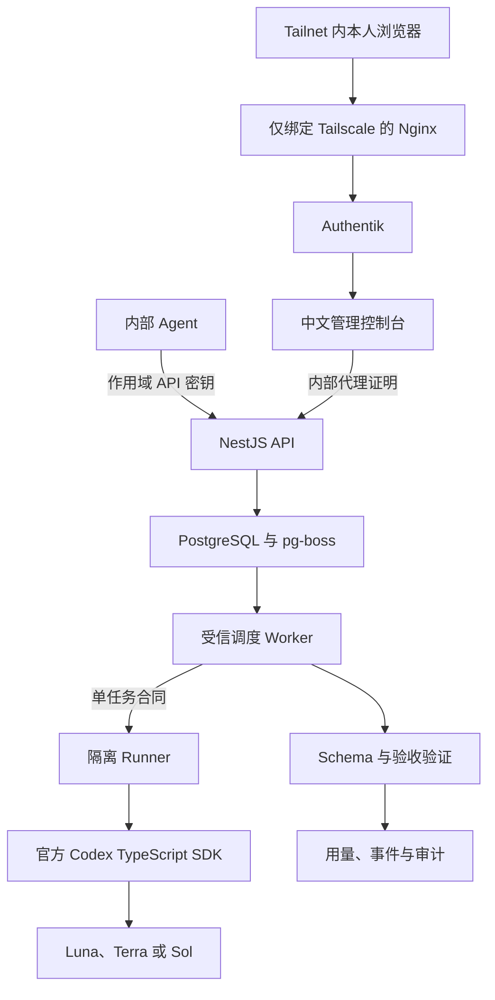

<div align="center">

# AIALRA Model Router

面向账户所有者个人设备与内部 Agent 的 Codex-only 私有任务路由器

`Responses 子集` · `持久 Jobs` · `Luna / Terra / Sol` · `MCP` · `中文控制台`

状态：`0.1.0 私有预发布`　许可：`Apache-2.0`　范围：本人设备与 AIALRA 内部自动化

[中文](README.md) · [English](README.en.md) · [使用指南](docs/usage.md) · [部署指南](docs/deployment.md) · [安全政策](SECURITY.md)

部署后的根路径直接进入 Authentik 登录，示例地址使用 `https://router.example.com`


图 1　使用合成任务和合成额度生成的中文控制台；不含真实账号、任务、路径或内部编号

</div>

## 1 项目定位

AIALRA Model Router 把已经登录的 Codex 执行器接到一个私有控制面。网页、脚本和内部 Agent 可以通过统一接口提交任务，并在接单时固定使用 Luna、Terra 或 Sol。

本项目只执行 Codex。仓库中没有其他模型供应商的适配器、密钥、路由分支和费用账本。

首版提供：

- 中文私有管理控制台与仓库内使用文档
- `POST /v1/responses` 的文本、JSON Schema 和流式响应子集
- 持久 Jobs、批次、状态事件、取消、验证和幂等
- 确定性的 Luna、Terra、Sol 路由与 Codex 额度水位保护
- CLI、MCP 和 TypeScript 客户端
- Authentik 浏览器登录与作用域 API 密钥
- PostgreSQL 队列、加密正文、审计和删除回执

这不是 OpenAI 官方项目，也不是 OpenAI API 服务、订阅转售服务或多供应商网关。OpenAI、Codex 及相关标识归其权利人所有。

## 2 用户入口

| 入口       | 地址或命令                   | 用途                             | 身份验证  |
| ---------- | ---------------------------- | -------------------------------- | --------- |
| 登录入口   | `/`                          | 直接进入私有控制台登录           | Authentik |
| 内部文档   | `/docs`                      | 快速开始、契约和错误码           | Authentik |
| 管理控制台 | `/console`                   | 在线调用、任务、额度、密钥和审计 | Authentik |
| Responses  | `POST /v1/responses`         | 迁移模型式文本调用               | API 密钥  |
| Jobs       | `POST /api/v1/jobs`          | 长任务、批次和事件               | API 密钥  |
| OpenAPI    | `/openapi`、`/openapi.json`  | HTTP 契约                        | Tailnet   |
| CLI        | `node apps/cli/dist/main.js` | PowerShell 与流水线              | API 密钥  |
| MCP        | `node apps/mcp/dist/main.js` | Agent 委派                       | API 密钥  |

生产环境中，Nginx 先让 Authentik 验证浏览器，再把受保护身份交给 Next.js；Next.js 使用另一份内部证明调用 NestJS。外部 Agent 不经过浏览器登录，只使用有范围、有限速、可到期和可吊销的 API 密钥。

## 3 本地运行

需要 Node.js 22、pnpm 10、Docker Compose 和一个专用的 Codex 登录目录。

```powershell
pnpm install # 安装单仓库依赖
codex login status # 确认当前专用 Codex 登录有效
pwsh ./deploy/scripts/prepare-local.ps1 # 生成本地数据库、加密和认证密钥
docker compose --env-file ./deploy/local.env -f ./deploy/compose.yaml --profile codex up --build -d # 启动数据库、API、中文网页和 Worker
docker compose --env-file ./deploy/local.env -f ./deploy/compose.yaml --profile codex ps # 核对健康状态
```

首次本地使用：

1. 打开 `http://localhost:13211/setup`。
2. 从 `deploy/secrets/bootstrap_admin_token` 读取一次性 Token。
3. 注册 Passkey，并把恢复码离线保存。
4. 打开 `http://localhost:13211/console/playground` 提交任务。
5. 在 `http://localhost:13211/console/keys` 创建 Agent API 密钥；明文只显示一次。

本地使用 Passkey 是为了无需安装 Authentik。VPS 生产入口使用既有 Authentik。

## 4 API 调用案例

### 4.1 Responses 调用

```powershell
$RouterUrl = "https://router.example.com" # 替换为部署者提供的 HTTPS 地址
$Headers = @{
  Authorization = "Bearer $env:MODEL_ROUTER_API_KEY" # 从当前进程读取一次显示的密钥
  "Idempotency-Key" = [guid]::NewGuid().ToString() # 重试同一请求时复用原值
}
$Body = @{
  model = "luna" # 可选 auto、luna、terra、sol
  input = "把这条合成告警归纳成 3 个要点"
  reasoning = @{ effort = "low" }
} | ConvertTo-Json -Depth 6
Invoke-RestMethod -Method Post -Uri "$RouterUrl/v1/responses" -Headers $Headers -ContentType "application/json" -Body $Body
```

成功结果包含实际模型、输出、状态、内部任务编号和独立的 Codex Credits 用量。未支持的 Responses 字段返回 `400 unsupported_parameter`，不会静默忽略。

### 4.2 JSON Schema 调用

```powershell
$Schema = @{
  type = "object"
  properties = @{
    category = @{ type = "string"; enum = @("通知", "行动项", "垃圾信息") }
    confidence = @{ type = "number"; minimum = 0; maximum = 1 }
  }
  required = @("category", "confidence")
  additionalProperties = $false
}
$Body = @{
  model = "luna"
  input = "证书将在三天后到期，请安排续期"
  text = @{ format = @{ type = "json_schema"; name = "classification"; schema = $Schema; strict = $true } }
} | ConvertTo-Json -Depth 12
Invoke-RestMethod -Method Post -Uri "$RouterUrl/v1/responses" -Headers $Headers -ContentType "application/json" -Body $Body
```

### 4.3 持久 Jobs 调用

```powershell
$JobBody = @{
  task = @{
    objective = "审查给定的合成 TypeScript 片段，只列出可证明的问题"
    taskKind = "review"
    model = "auto"
    effort = "medium"
    expectedOutput = "最多返回 3 项问题、证据和修复建议"
    permissions = @{ filesystem = "read"; network = "none" }
    deadlineMs = 120000
  }
} | ConvertTo-Json -Depth 10
$Job = Invoke-RestMethod -Method Post -Uri "$RouterUrl/api/v1/jobs" -Headers $Headers -ContentType "application/json" -Body $JobBody
Invoke-RestMethod -Method Get -Uri "$RouterUrl/api/v1/jobs/$($Job.id)" -Headers @{ Authorization = $Headers.Authorization }
```

状态依次为 `accepted → queued → running → validating`，终态为 `succeeded | needs_review | failed | cancelled | expired`。

## 5 程序化调用

```powershell
$env:MODEL_ROUTER_URL = "https://router.example.com"
$env:MODEL_ROUTER_API_KEY = "<在安全终端中设置的密钥>"
pnpm build
node apps/cli/dist/main.js call --task "只返回 OK" --kind bounded --model luna --effort low
node apps/cli/dist/main.js jobs --limit 20
node apps/cli/dist/main.js quota
```

MCP 提供 `delegate_codex`、`preview_route`、`job_status`、`cancel_job` 和 `quota_snapshot`。委派深度固定为 1，子任务没有再次委派能力。

TypeScript 使用 `ModelRouterClient`：

```typescript
import { ModelRouterClient } from "@aialra/model-router-client";

const client = new ModelRouterClient({
  baseUrl: process.env.MODEL_ROUTER_URL!,
  apiKey: process.env.MODEL_ROUTER_API_KEY!,
});

const result = await client.createResponse({ model: "luna", input: "只返回 OK" });
console.log(result.output);
```

## 6 架构



路由在接单时选定一个模型和推理等级。任务开始输出后不会自动换模型；Schema 或验收失败进入 `needs_review`，由人决定是否显式重跑。

| 任务特征                     | 默认模型 | 典型案例                     |
| ---------------------------- | -------- | ---------------------------- |
| 边界清楚、结构化、可自动验证 | Luna     | 分类、抽取、格式转换、短摘要 |
| 日常编码、调试、集成和审查   | Terra    | 修复、审查和集成任务         |
| 高歧义、高风险或分歧裁决     | Sol      | 架构、威胁分析和复杂规划     |

## 7 安全边界

- 受信调度 Worker 持有数据库连接和正文主密钥，但不运行 Codex 子任务。
- 隔离 Runner 只获得单项任务合同、一次性工作区和 Codex 身份挂载，不获得数据库、正文主密钥或控制面环境变量。
- 任务沙箱默认拒绝整个根文件系统，并显式拒绝 `/run/secrets`、进程环境和 Codex 身份目录。
- 首版拒绝所有联网任务，因为域名允许清单出口代理尚未验收。
- 首版安全清理模式不支持 `sessionKey`，并在任务结束后删除 Codex 会话文件。
- 默认任务是只读、无网络、120 秒；写入需要明确任务合同和审批。
- API 密钥只保存固定前缀与 HMAC-SHA-256 摘要；默认 30 天、60 次/分钟，创建和吊销都要求幂等键与确认。
- 任务正文和事件采用带 Job ID、字段名与版本 AAD 的每记录 AES-256-GCM 信封加密；正文与事件 24 小时后删除，脱敏元数据 90 天后删除。
- Authentik 身份必须属于 Router 专用组，并同时通过 Nginx→Web 与 Web→API 两份独立证明。
- 仓库截图只能使用合成数据，生产根路径直接进入 Authentik。

详细攻击面和剩余风险见[威胁模型](docs/threat-model.md)。

## 8 VPS 部署

生产部署使用现有 Docker Compose、Tailscale、Nginx、Authentik 和 Cloudflare DNS：

1. `prepare-vps.sh` 创建专用账户和目录。
2. `prepare-production.sh` 生成 root-only 密钥，默认关闭任务接单。
3. `install-compose-release.sh` 构建并启动 PostgreSQL、API 和 Web。
4. `upsert-cloudflare-dns.sh` 幂等创建指向 Tailscale IPv6 的 DNS-only AAAA 记录。
5. Certbot 使用 Cloudflare DNS challenge 签发证书。
6. `register-auth-gateway-app.sh` 注册 Authentik 应用和严格匹配的 OAuth 回调地址，失败时自动恢复原清单。
7. `render-nginx.sh` 生成只绑定 Tailscale 接口的 Nginx 配置，`nginx -t` 通过后再重载。
8. 专用 `aialra-router` 账户完成 Codex 登录和身份目录隔离探针。
9. `enable-codex-worker.sh` 启动隔离 Runner 与唯一受信 Worker，并在攻击探针和健康检查通过后开放接单。

完整命令、回滚点和验收清单见[部署指南](docs/deployment.md)。仓库模板使用 `router.example.com`；真实域名和服务器路径不会写进公开仓库。

## 9 仓库结构

```text
apps/api        # NestJS 控制面、Responses 与 Jobs
apps/web        # Next.js 中文站点、登录和管理控制台
apps/worker     # 持有数据库与主密钥的受信调度器
apps/runner     # 无数据库凭据的隔离 Codex 执行器
apps/cli        # 命令行客户端
apps/mcp        # MCP 委派工具
packages        # 契约、路由、持久化、安全、Provider 和客户端
openapi         # HTTP 接口的唯一契约
deploy          # Compose、容器、Nginx、DNS、备份和部署脚本
skill           # 可复用的路由使用 Skill
evals           # 匿名评测任务和报告结构
```

## 10 验证

```powershell
pnpm check # 格式、静态检查、类型、单元与集成测试、生产构建
```

已经自动覆盖路由、额度解析、调用者授权、密钥幂等、Authentik Group 与代理证明、AAD 加密、保留、Responses 错误、Runner 环境清理、Worker 输出扫描和中文 Web 构建。2026-08-26 的旧版 VPS 基线曾确认：

- ChatGPT 身份的专用 Codex Worker 可以调用 Luna；
- 普通 Responses、SSE、JSON Schema、Jobs、事件和相同幂等键复用均成功；
- 旧版 Codex 沙箱无法读取认证文件，也无法解析外部域名；新版 Worker/Runner 拆分仍须在恢复接单前重新运行攻击探针；
- 未登录控制台会跳转到 Authentik，公开中文页面返回 200；
- PostgreSQL 加密备份可以由相同主版本的工具读取。

仍属于正式公开发布门槛的项目包括：30/150 项匿名评测、并发 1→2→4、24 小时稳定试验、完整恢复演练和最终镜像 SBOM。当前 GitHub 仓库保持私有；旧历史门禁仍为 `incomplete`，尚未生成可发布的单根副本。详情见[实施状态](docs/implementation-status.md)。

## 11 复用方式

OpenAPI 是 HTTP 契约的唯一来源；客户端由它生成。部署中的主机名、凭据、证书和 Authentik 清单都通过环境变量或 root-only 文件注入，不进入 Git。

贡献流程见[贡献指南](CONTRIBUTING.md)，漏洞使用[安全政策](SECURITY.md)中的私密渠道报告。

## 12 许可记录

仓库采用 [Apache-2.0](LICENSE)。第三方组件和 clean-room 记录见 [THIRD_PARTY_NOTICES](THIRD_PARTY_NOTICES)。许可证记录已由仓库所有者确认可发布；该确认不替代针对商标、订阅条款或专利的法律意见。

经限定检索发现，本项目的差异化是 Codex-only 任务合同、确定性模型选择、额度水位、双层 Authentik 代理证明、结果验证与可复现实验的组合；不主张“首个”或“唯一”。
