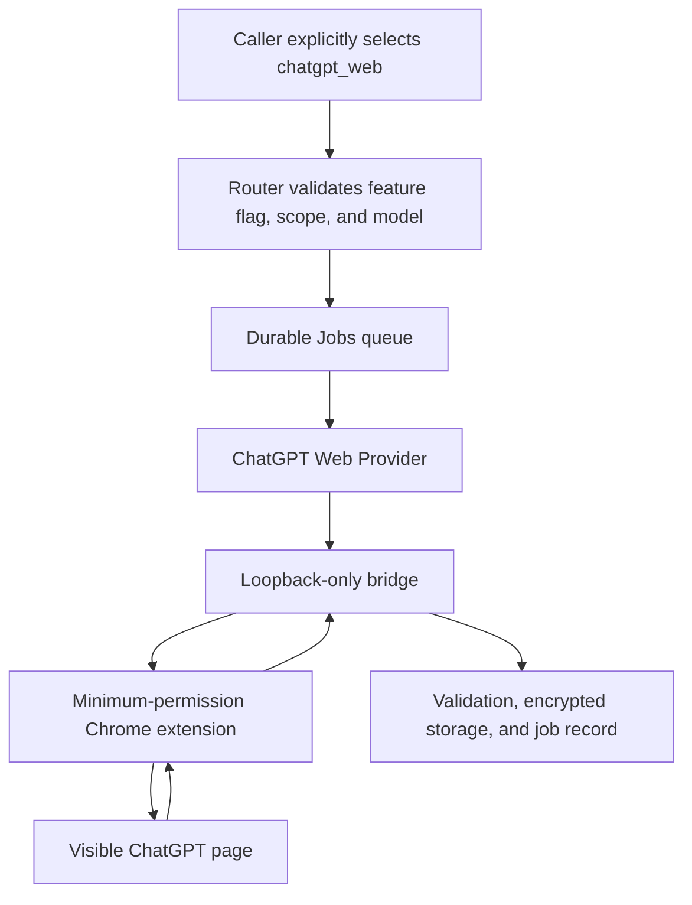

# ChatGPT Pro Web Experimental Channel

## 1 Status and boundary

This channel sends an explicit Router job to a visible ChatGPT page, where a minimum-permission Chrome extension enters the prompt and reads the final answer.

It is not an official API and is not guaranteed to remain available. UI structure, sign-in, the model menu, verification screens, and generation states can change without notice.

The repository defaults to `CHATGPT_WEB_ADAPTER_ENABLED=false`. The API rejects web jobs until an administrator completes the real-page probe and explicitly enables the adapter.

Personal or non-profit use does not automatically remove terms risk. OpenAI's Terms of Use prohibit automatic or programmatic extraction of data or output and circumvention of protective measures [1]. ChatGPT Pro remains subject to those terms [2].

The implementation does not read cookies, copy browser tokens, call a private `backend-api`, intercept site Server-Sent Events, expose a remote Chrome DevTools Protocol port, automate verification, or disguise browser fingerprints.

## 2 Architecture



Figure 2.1. Execution path for an explicit ChatGPT web job.

The browser prewarms one work tab. Every job first enters a new non-personalized Temporary Chat and proves that user turns, assistant turns, composer content, and generation state are all empty.

The extension only locates the editor, controls, turns, and generation state. A native X11 input agent inside the isolated container activates the tab, clicks the editor, clears it, pastes the prompt, and clears the temporary clipboard after a character-for-character DOM check. The extension requests no page clipboard permission.

The extension returns an answer only after the exact user echo appears, the assistant turn follows it, tab and document binding remain unchanged, terminal turn actions appear, generation ends, and two reads of the body remain stable.

There is no automatic retry after send. An uncertain send returns `chatgpt_delivery_uncertain` instead of risking a duplicate conversation or duplicate Pro usage.

A failed tab is quarantined for ten minutes for noVNC inspection. Only element counts, lengths, SHA-256 digests, stage, and error class are recorded. The tab then navigates to a fresh conversation and repeats the zero-message check.

## 3 Deployment

The visible browser runs as a dedicated non-root user with a read-only root filesystem and a temporary download directory. Its persistent profile volume is a credential, uses mode `0700`, and is excluded from ordinary backups.

The browser gets no database, payload key, Codex identity, container socket, host directory, or other service credential. A controlled proxy is its only egress path and denies loopback, private, Tailnet, Docker, and cloud-metadata destinations.

The browser uses dedicated seccomp and AppArmor policies derived from Docker's default boundary, adding only the namespace-related system calls Chromium needs. It remains non-root, capability-free, no-new-privileges, and read-only.

Chrome 116 and later can keep an extension service-worker WebSocket alive through regular activity [3]. The extension uses that documented mechanism with a short keepalive interval.

Start the components without opening admission:

```bash
# Build the experiment while keeping CHATGPT_WEB_ADAPTER_ENABLED=false.
ACTION=start \
PRODUCTION_ENV=/var/lib/aialra-model-router/production.env \
RELEASE_DIR=/srv/example/model-router/releases/<commit> \
bash deploy/scripts/enable-chatgpt-web.sh
```

From the Tailnet, open `https://router.example.com/chatgpt-browser/`, pass Authentik, and sign in manually through noVNC. Handle verification and account warnings only in that visible page.

Verify the outer and Chromium sandbox, then inspect `chrome://sandbox` in the protected visible browser:

```bash
BROWSER_CONTAINER=aialra-model-router-chatgpt-browser-1 \
bash deploy/scripts/verify-chatgpt-browser-sandbox.sh
```

## 4 Real-page probe

Real ChatGPT page tests never run in GitHub Actions. An administrator explicitly runs ten anonymous jobs on the VPS:

- four short chat jobs;
- four search jobs requiring at least one public source;
- two deep-research jobs with a maximum deadline of 3,600 seconds.

The gate requires at least 9/10 successful jobs, both deep-research jobs, at least three chat jobs, exactly one submission per job, zero duplicate sends, zero result misattributions, and no browser restart during the run.

Only after the gate passes:

```bash
# Open Router admission for the experimental channel after the real probe passes.
ACTION=enable \
PRODUCTION_ENV=/var/lib/aialra-model-router/production.env \
RELEASE_DIR=/srv/example/model-router/releases/<commit> \
bash deploy/scripts/enable-chatgpt-web.sh
```

### 4.1 Current VPS qualification result

As of 2026-08-29, the release gate has not passed and the experimental channel remains disabled.

The following results are retained strictly as the 2026-08-29 real-page v1 historical baseline. They do not prove that the 2026-08-31 convergence build has been deployed or qualified.

- Chromium sandbox checks passed for user namespaces, seccomp, AppArmor, `no-new-privileges`, and process arguments. The administrator check of `chrome://sandbox` in the protected visible browser is still pending.
- After extending the first-token grace period from 2,000 ms by mode, the isolated `chat-01` probe succeeded in 19,150 ms with 40 output characters and one submission.
- After removing the duplicate input event, a fresh three-chat sequence passed only `chat-01`. `chat-02` and `chat-03` left visible blank assistant containers after 42,662 ms and 47,634 ms, so the stability result is 1/3.
- The two failed records matched the expected user-message lengths at 72/72 and 54/54. Each had exactly one submission and no foreign task marker.
- Historical Temporary Chat result: chat and search produced blank assistant messages at that time. This is an old-version failure baseline, not the current public contract.
- The 3/3 chat stability gate failed, so deep research and the complete ten-job gate were not run. Do not run the enable command.

These measurements come from redacted VPS real-page probe records. The records keep phases, length, digest, and duration, but not full answers.

The failure is localized to the ChatGPT page output layer. The failed job's user message appeared on the page, but the page created an assistant turn without visible body text. Search in the same browser returned text and a source, so sign-in, controlled egress, and Router result delivery are not globally broken.

The current evidence does not establish why ChatGPT intermittently creates a blank assistant turn for ordinary chat. The first-token wait and duplicate-input-event hypotheses were tested separately, but the consecutive stability gate still failed. The stop condition now prevents further page patches, so the release state remains disabled.

The 2026-08-31 convergence contract is fixed to `conversationMode="temporary_per_request"`, `temporaryChat=true`, and `personalized=false`: every job must create a new non-personalized Temporary Chat, and persistent sessions or `sessionKey` continuation are rejected. This policy still has to pass the real-page gate on the VPS, so production web admission remains disabled until then.

Diagnostic mode uses a separate feature flag and a loopback token while production admission stays disabled. A single explicit probe records only stages, counts, text lengths, visibility, digests, and timing to distinguish blank page generation, rendering failure, selector drift, and incomplete output.

### 4.2 Zero-call page probe

The read-only probe requests only bridge health, diagnostics, and model catalog endpoints. It never calls `/invoke`, enters text, or creates a ChatGPT conversation.

```bash
# Address the bridge only from a trusted operations environment.
export CHATGPT_BRIDGE_URL=http://chatgpt-browser:13216
# Read the bridge secret from a root-only file without printing it.
export CHATGPT_BRIDGE_API_TOKEN_FILE=/run/secrets/chatgpt_bridge_api_token
# Verify that the experimental channel remains disabled.
export EXPECTED_ADAPTER_ENABLED=false
# Check sign-in, page controls, idle state, and redacted page structure.
node deploy/scripts/probe-chatgpt-web-readiness.mjs
```

A passing probe proves only that the current sign-in is valid, page controls are recognizable, and no web task is running. It does not prove stable chat, search, or deep-research output.

### 4.3 Console qualification entry

The protected “ChatGPT web channel” page can run five suites:

- `readiness`: read-only, with no message sent;
- `single_probe`: one ordinary chat, and the minimum gate for enabling the web channel;
- `chat_3`: three consecutive chat jobs;
- `deep_2`: two consecutive deep-research jobs;
- `full_10`: four chats, four searches, and two deep-research jobs.

Create a run with `POST /api/v1/chatgpt-web/qualification-runs` and an `Idempotency-Key`. Read it from `GET /api/v1/chatgpt-web/qualification-runs/{id}`.

Qualification records exclude prompts, answers, accounts, and conversation URLs. They contain only item state, duration, output length, output SHA-256, source count, submission count, ownership result, Temporary Chat verification, and error code.

## 5 Calling the channel

### 5.1 Responses

```powershell
$RouterUrl = "https://router.example.com" # Use the protected Router address.
$Headers = @{ # Web jobs require jobs:write and chatgpt:web scopes.
    Authorization = "Bearer $env:MODEL_ROUTER_API_KEY" # Read the key from the current process only.
    "Idempotency-Key" = [guid]::NewGuid().ToString() # Reuse this value for retries of the same business request.
} # Finish the request headers.
$Body = @{ # Explicitly select the web experiment.
    model = "chatgpt-web.auto" # Use an administrator-enabled web model entry.
    input = "Research a synthetic topic and list public sources" # Keep credentials and personal data out of the prompt.
    aialra = @{ # These are namespaced Router extensions.
        execution_channel = "chatgpt_web" # Codex requests never switch here implicitly.
        chatgpt_mode = "search" # Select page search mode.
        conversation_mode = "temporary_per_request" # Create a new Temporary Chat for this job.
        temporary_chat = $true # The contract accepts only non-personalized Temporary Chat.
        require_sources = $true # Ask the bridge to extract public sources.
    } # Finish the experiment options.
} | ConvertTo-Json -Depth 8 # Preserve all nested fields.
Invoke-RestMethod -Method Post -Uri "$RouterUrl/v1/responses" -Headers $Headers -ContentType "application/json" -Body $Body # Wait for the final complete text.
```

Streaming requests emit state and one complete final body; they do not fabricate token deltas. Prefer Jobs for deep research rather than holding an HTTP request for up to one hour.

### 5.2 Jobs

```json
{
  "task": {
    "executionChannel": "chatgpt_web",
    "model": "chatgpt-web.auto",
    "objective": "Research a synthetic topic and list public sources",
    "chatgptWeb": {
      "mode": "search",
      "conversationMode": "temporary_per_request",
      "temporaryChat": true,
      "personalized": false,
      "requireSources": true
    },
    "deadlineMs": 600000
  }
}
```

JSON cannot legally contain comments. See [`openapi/openapi.yaml`](../openapi/openapi.yaml) for field constraints.

Every web job uses a new non-personalized Temporary Chat. The old blank-result observation remains in section 4.1 only as a historical baseline. A successful `single_probe` is sufficient to enable production web admission at concurrency one; `full_10` remains optional strengthening evidence. Timeouts, rate limits, sign-in failures, verification prompts, UI changes, and uncertain delivery are never retried automatically.

### 5.3 CLI and MCP

```powershell
node apps/cli/dist/main.js research --task "Research a synthetic topic" --mode search --model chatgpt-web.auto # Create a web-search job and print its id.
node apps/cli/dist/main.js jobs --limit 20 # Inspect recent jobs and terminal states.
```

The MCP tool `delegate_chatgpt` accepts `objective`, `mode`, `model`, `require_sources`, and `deadline_ms`. It returns a job id for `job_status`; web jobs cannot delegate again.

## 6 Models, usage, and errors

Web models come from the visible page's current model menu. `GET /api/v1/models` reports web visibility separately from Router enablement, and an administrator must enable each model.

The page supplies no reliable token, Codex Credit, quota-delta, or API-equivalent-price measurement. Results use `measurementStatus: "unavailable"`; the console displays that the page did not provide reliable data and never substitutes zero.

| Error                             | Direct cause                                     | Next action                                                      |
| --------------------------------- | ------------------------------------------------ | ---------------------------------------------------------------- |
| `chatgpt_login_required`          | The dedicated browser is signed out              | Open noVNC and sign in manually                                  |
| `chatgpt_verification_required`   | Verification is visible                          | Complete it manually; the system does not bypass it              |
| `chatgpt_ui_changed`              | Required UI elements are unrecognized            | Close admission and update the synthetic DOM contract            |
| `chatgpt_rate_limited`            | The page shows a usage or rate limit             | Wait for the page's stated recovery time                         |
| `chatgpt_delivery_uncertain`      | The bridge cannot prove whether send occurred    | Keep the job failed and do not auto-resend                       |
| `chatgpt_output_incomplete`       | The final text never became provably stable      | Inspect the visible page and extension state                     |
| `chatgpt_page_generation_blank`   | The page created an assistant turn without text  | Keep admission closed and inspect page mode and generation state |
| `chatgpt_page_rendering_failed`   | DOM text exists but is not visible               | Repair rendering detection and rerun the stable-chat gate        |
| `chatgpt_output_selector_changed` | Visible output exists outside the known selector | Update result targeting and rerun the complete gate              |
| `chatgpt_clarification_required`  | Deep research asks for more information          | Amend the contract and create a new job                          |
| `chatgpt_timeout`                 | The job exceeded its own deadline                | Inspect the page before deciding on a new job                    |

`chatgpt_rate_limited` uses HTTP `429`; the body `retryAfter` value and the `Retry-After` response header always carry the same number of seconds.

## 7 Concurrency and automatic shutdown

After a successful `single_probe`, web admission runs at concurrency one and deployment uses exactly one Worker; `full_10` remains optional strengthening evidence. A dedicated in-process dispatch queue serializes state read, minimum-interval wait, and submission reservation; web submissions are at least 90 seconds apart.

Web rate limits use progressive 30-, 60-, and 120-minute cooldowns. Expiry admits only one recovery probe. A successful probe enters observation, and three consecutive successes are required to clear that state; another rate limit returns to the next cooldown. Sign-out, verification, UI drift, duplicate sends, or result misattribution closes the channel and requires requalification. The official Codex SDK channel remains independent.

Administrators can read the secret-free state from `GET /api/v1/chatgpt-web/status`, including sandbox, sign-in, concurrency, queue, circuit, and qualification fields.

Disable admission but keep the visible browser for diagnosis:

```bash
# Close web-job admission without deleting the browser profile or job history.
ACTION=disable \
PRODUCTION_ENV=/var/lib/aialra-model-router/production.env \
RELEASE_DIR=/srv/example/model-router/releases/<commit> \
bash deploy/scripts/enable-chatgpt-web.sh
```

Stop all experimental components:

```bash
# Stop the bridge, visible browser, and egress proxy without deleting the profile volume.
ACTION=stop \
PRODUCTION_ENV=/var/lib/aialra-model-router/production.env \
RELEASE_DIR=/srv/example/model-router/releases/<commit> \
bash deploy/scripts/enable-chatgpt-web.sh
```

## 8 References

[1] OpenAI, “Terms of Use.” <https://openai.com/policies/terms-of-use/>

[2] OpenAI, “About ChatGPT Pro.” <https://help.openai.com/en/articles/9793128/>

[3] Chrome for Developers, “Use WebSockets in service workers.” <https://developer.chrome.com/docs/extensions/how-to/web-platform/websockets>

[4] AIALRA-0, “TrilliumFlow.” <https://github.com/AIALRA-0/TrilliumFlow>

[5] miuuyy, “codex-chatgpt-web.” <https://github.com/miuuyy/codex-chatgpt-web>

[6] Octo-Lex, “ChatGPT-Web2API.” <https://github.com/Octo-Lex/ChatGPT-Web2API>

[7] DrA1ex, “chatgpt-bridge.” <https://github.com/DrA1ex/chatgpt-bridge>
