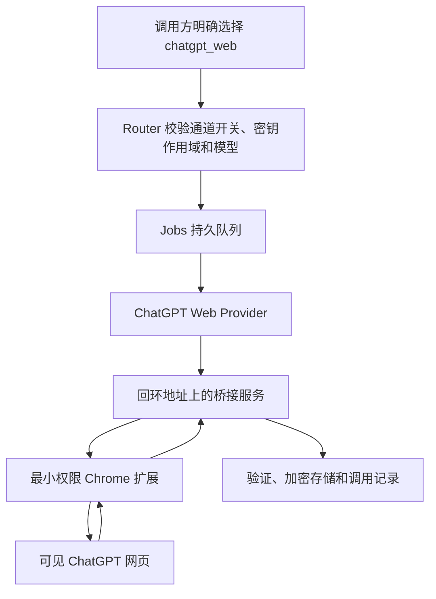

# ChatGPT Pro 网页实验通道

## 1 通道状态

该通道把 Router 任务交给一台可见的 ChatGPT 网页浏览器，再由最小权限 Chrome 扩展输入任务并读取最终回答

它不是官方 API，也不保证长期可用；ChatGPT 的页面结构、登录流程、模型菜单、验证页面和生成状态变化都可能使调用中断

仓库默认设置 `CHATGPT_WEB_ADAPTER_ENABLED=false`；完成本页的真实网页探针并由管理员明确启用前，API 会拒绝网页任务

个人或非盈利使用不会自动消除服务条款风险；OpenAI 使用条款禁止自动或程序化提取数据或输出，也禁止规避保护措施 [1]；ChatGPT Pro 说明同时要求遵守使用条款 [2]

实现遵守以下固定边界：

- 登录：管理员只在受 Tailnet 和 Authentik 保护的可见 noVNC 页面中手动登录
- 页面控制：扩展只使用可访问名称、语义化 DOM 与 `MutationObserver`
- 凭据：代码不读取 Cookie，不复制网页登录令牌，不调用私有 `backend-api`
- 传输：代码不拦截站点 Server-Sent Events，不开放 Chrome DevTools Protocol 远程调试端口
- 验证：出现验证码、重新登录或账号警告时立即暂停并通知管理员
- 反自动化：不增加指纹伪装、验证码绕过或保护规避代码

## 2 执行流程



图 2.1 ChatGPT Pro 网页实验任务从接单到结果保存的流程

浏览器启动后预热 1 个工作标签；每项任务都先进入新的非个性化 Temporary Chat，并确认用户消息、助手消息、编辑器内容和生成状态全部为空

扩展只负责定位编辑器、按钮、回合和生成状态；实际输入由隔离容器中的 X11 原生键鼠代理完成：激活标签、点击编辑器、清空、粘贴、逐字核对后立即清空临时剪贴板，扩展不申请网页剪贴板权限

扩展只有在本任务的用户消息精确回显、助手回合位于其后、标签与文档绑定不变、终态操作栏出现、生成结束且正文连续两次稳定时才返回结果

任务发送后不会自动重试；无法确认是否已经发送时返回 `chatgpt_delivery_uncertain`，防止重复创建对话或重复消耗 Pro 用量

失败标签冻结 10 分钟，供管理员从 noVNC 查看现场；系统只记录元素数量、长度、SHA-256 摘要、阶段和错误分类，随后自动进入新对话并重新检查零消息状态

## 3 安全部署

### 3.1 组件边界

- 浏览器账户：专用非 root 用户运行 Chromium，根文件系统只读，下载目录使用临时文件系统
- 浏览器配置：持久配置卷保存登录状态，权限设为 `0700`，按登录凭据处理，不进入普通备份
- 桥接认证：每次浏览器启动生成新的扩展密钥；Worker 使用独立桥接密钥，两个密钥都不得写入任务正文
- 网络：浏览器只能通过受控出口代理访问允许的 ChatGPT、OpenAI、静态资源、登录和 Cloudflare 验证域名
- 内网阻断：出口代理拒绝回环、私网、Tailnet、Docker 网络和云主机元数据地址
- 秘密隔离：浏览器容器不获得数据库、正文主密钥、Codex 登录目录、容器套接字、宿主目录或其他服务凭据
- 沙箱：浏览器使用基于 Docker 默认策略的专用 seccomp 和 AppArmor 配置，只额外允许 Chromium 用户命名空间所需系统调用；仍保留非 root、全部 Capability 删除、`no-new-privileges` 和只读根文件系统

Chrome 扩展 Service Worker 使用 WebSocket 与桥接服务通信；官方说明 Chrome 116 起可以通过固定间隔活动维持此连接 [3]

### 3.2 启动但不开放调用

第一步，生成实验通道所需的随机密钥并保持功能开关关闭

```bash
# 生成本地部署文件和随机密钥，不会启用网页任务接单
bash deploy/scripts/prepare-production.sh
```

第二步，只启动可见浏览器、桥接服务和受控出口代理

```bash
# 构建实验组件并保持 CHATGPT_WEB_ADAPTER_ENABLED=false
ACTION=start \
PRODUCTION_ENV=/var/lib/aialra-model-router/production.env \
RELEASE_DIR=/srv/example/model-router/releases/<commit> \
bash deploy/scripts/enable-chatgpt-web.sh
```

第三步，从 Tailnet 内访问 `https://router.example.com/chatgpt-browser/`，通过 Authentik 后在 noVNC 页面手动登录 ChatGPT

第四步，检查桥接健康和只读页面探针；探针必须识别登录状态、模型菜单、Temporary Chat、编辑器、发送按钮和结果区域

第五步，验证外层和 Chromium 沙箱；脚本检查用户命名空间、seccomp、AppArmor、进程参数和桥接健康，管理员还需要在受保护的可见浏览器中核对 `chrome://sandbox`

```bash
BROWSER_CONTAINER=aialra-model-router-chatgpt-browser-1 \
bash deploy/scripts/verify-chatgpt-browser-sandbox.sh
```

## 4 真实网页探针

真实网页测试不会在 GitHub Actions 中运行；管理员需要在 VPS 上显式启动以下 10 个匿名任务：

- 普通聊天：4 个只要求短文本结果的合成任务
- 联网搜索：4 个要求至少 1 个公网来源的合成任务
- 深度研究：2 个允许等待最长 3600 秒的合成任务

进入下一阶段必须同时满足：

- 完成数量：至少 9/10 个任务成功
- 深度研究：2/2 成功；普通聊天至少 3/4 成功
- 提交次数：每项恰好出现 1 次 `submitted`
- 重复发送：0 次
- 错误归属：0 次，即结果没有来自其他任务或其他标签
- 运行连续性：测试期间浏览器、扩展和桥接服务没有重启
- 健康检查：模型菜单、编辑器、发送状态和结果区域均可识别

达到门槛后再执行：

```bash
# 只有真实探针通过后才开放 Router 对网页任务的接单
ACTION=enable \
PRODUCTION_ENV=/var/lib/aialra-model-router/production.env \
RELEASE_DIR=/srv/example/model-router/releases/<commit> \
bash deploy/scripts/enable-chatgpt-web.sh
```

### 4.1 当前 VPS 验证结果

截至 2026-08-29，发布门禁仍未通过；实验通道保持关闭

以下结果严格保留为 2026-08-29 的 v1 真实网页历史基线，不能证明 2026-08-31 收尾版本已经部署或通过门禁

- Chromium 沙箱：用户命名空间、seccomp、AppArmor、`no-new-privileges` 和进程参数检查已通过；受保护可见页面中的 `chrome://sandbox` 管理员核对仍待完成
- 单项修复探针：把首个 Token 等待时间从 `2,000 ms` 按模式延长后，`chat-01` 成功，耗时 `19,150 ms`，输出长度为 `40`，提交次数为 `1`
- 连续普通聊天：移除重复输入事件后重新运行 `3` 项，只有 `chat-01` 成功；`chat-02` 和 `chat-03` 分别在 `42,662 ms` 和 `47,634 ms` 后留下可见空助手容器，因此稳定门结果为 `1/3`
- 消息归属：两项失败记录的用户消息长度与预期分别为 `72/72` 和 `54/54`，均完全匹配；每项只有 `1` 次提交，没有发现其他任务标记
- 历史临时对话结果：当时普通聊天和联网搜索都观察到空白助手消息；这是旧版本的失败基线，不是当前公共契约
- 发布结论：普通聊天稳定门没有达到 `3/3`，因此没有继续运行深度研究和完整 `10` 项门禁；不得执行启用命令

这些数值来自 VPS 真实网页探针的脱敏结果记录；记录只保存阶段、长度、摘要和耗时，不保存完整回答

故障已经定位到 ChatGPT 页面输出层；失败任务的用户消息已经出现在页面中，但页面创建的助手消息没有可见正文，桥接器因此没有结果可返回；同一浏览器的联网搜索可以返回正文和来源，说明登录、受控出口和 Router 结果回传链路并非整体失效

当前材料不能证明 ChatGPT 为什么间歇性地为普通聊天创建空白助手消息；首个 Token 等待和重复输入事件两个假设均已单独验证，连续稳定门仍失败；系统按停止条件不继续叠加页面补丁，因此发布状态继续保持关闭

2026-08-31 收尾版本把当前契约固定为 `conversationMode="temporary_per_request"`、`temporaryChat=true` 和 `personalized=false`：每项任务必须创建新的非个性化 Temporary Chat，不允许持久会话或 `sessionKey` 续接。该策略仍需重新完成本页真实门禁；门禁通过前生产网页通道继续关闭

诊断模式使用独立开关和回环令牌，在生产 API 仍关闭时只允许 1 个显式探针；它只保存元素数量、文本长度、可见性、阶段和摘要，用于区分页面未生成正文、页面渲染失败、结果定位规则失效和输出未完成

### 4.2 零调用页面探针

只读探针仅请求桥接服务的健康、诊断和模型目录接口；它不会调用 `/invoke`，不会输入文字，也不会创建 ChatGPT 对话

```bash
# 指向只能从受信运维环境访问的浏览器桥接服务
export CHATGPT_BRIDGE_URL=http://chatgpt-browser:13216
# 从 root-only 文件读取桥接密钥，脚本不会打印密钥
export CHATGPT_BRIDGE_API_TOKEN_FILE=/run/secrets/chatgpt_bridge_api_token
# 验证实验通道仍保持关闭
export EXPECTED_ADAPTER_ENABLED=false
# 检查登录、页面控件、任务空闲状态和脱敏页面结构
node deploy/scripts/probe-chatgpt-web-readiness.mjs
```

探针通过只证明当前登录有效、页面控件可识别且没有运行中的网页任务；它不能证明普通聊天、联网搜索或深度研究能够稳定生成结果

### 4.3 控制台验收入口

管理员在“ChatGPT 网页通道”页面可以运行四种套件：

- `readiness`：只读检查，不发送消息
- `chat_3`：连续 3 次普通聊天
- `deep_2`：连续 2 次深度研究
- `full_10`：4 次聊天、4 次搜索和 2 次深度研究

创建接口为 `POST /api/v1/chatgpt-web/qualification-runs`，必须提供 `Idempotency-Key`；查询接口为 `GET /api/v1/chatgpt-web/qualification-runs/{id}`

验收记录不保存提示词、回答、账号或对话地址，只保存每项状态、耗时、输出长度、输出 SHA-256、来源数、提交次数、任务归属结果和错误码

## 5 调用方法

### 5.1 Responses 兼容请求

```powershell
$RouterUrl = "https://router.example.com" # 使用受 Tailnet 保护的 Router 地址
$Headers = @{ # 网页任务需要 jobs:write 与 chatgpt:web 作用域
    Authorization = "Bearer $env:MODEL_ROUTER_API_KEY" # 从当前进程读取密钥，禁止写入仓库
    "Idempotency-Key" = [guid]::NewGuid().ToString() # 网络重试时复用相同键，防止创建重复任务
} # 完成请求头定义
$Body = @{ # 明确选择网页实验通道
    model = "chatgpt-web.auto" # 使用管理员启用的网页自动模型入口
    input = "调查一个合成主题，并列出公网来源" # 发送不含真实凭据或个人信息的任务
    aialra = @{ # AIALRA 扩展字段不会伪装成 OpenAI 官方字段
        execution_channel = "chatgpt_web" # 显式选择网页通道，普通 Codex 请求不会暗中切换
        chatgpt_mode = "search" # 使用网页搜索模式
        conversation_mode = "temporary_per_request" # 每项任务创建新的临时对话
        temporary_chat = $true # 当前契约只接受非个性化 Temporary Chat
        require_sources = $true # 要求桥接器提取回答中的公网来源
    } # 完成实验参数
} | ConvertTo-Json -Depth 8 # 保留嵌套字段
Invoke-RestMethod -Method Post -Uri "$RouterUrl/v1/responses" -Headers $Headers -ContentType "application/json" -Body $Body # 等待最终完整正文
```

网页流式请求只发送状态和 1 次最终完整正文，不伪造逐 Token 增量；长时间研究应使用 Jobs API，避免保持最长 1 小时的 HTTP 连接

### 5.2 Jobs 请求

```json
{
  "task": {
    "executionChannel": "chatgpt_web",
    "model": "chatgpt-web.auto",
    "objective": "调查一个合成主题，并列出公网来源",
    "chatgptWeb": {
      "mode": "search",
      "conversationMode": "temporary_per_request",
      "temporaryChat": true,
      "personalized": false,
      "requireSources": true
    },
    "deadlineMs": 600000
  }
}
```

该 JSON 不能合法加入注释；字段约束以 [`openapi/openapi.yaml`](../openapi/openapi.yaml) 为准

每个网页任务都固定使用新的非个性化 Temporary Chat；旧版本的空白结果仅保留在 4.1 节作为历史基线。当前版本通过真实门禁前，生产网页通道保持关闭

### 5.3 CLI 和 MCP

```powershell
node apps/cli/dist/main.js research --task "调查一个合成主题" --mode search --model chatgpt-web.auto # 创建网页搜索任务并返回任务编号
node apps/cli/dist/main.js jobs --limit 20 # 查询最近调用和最终状态
```

MCP 工具 `delegate_chatgpt` 接受 `objective`、`mode`、`model`、`require_sources` 和 `deadline_ms`；它只返回任务编号，Codex 需要通过 `job_status` 查询结果

网页任务的委派深度固定为 1，子任务不能再次调用 Router

## 6 模型、用量和错误

网页模型来自当前页面可见的模型菜单；`GET /api/v1/models` 分别显示“网页可见”和“Router 已启用”，管理员必须逐项启用后才能调用

ChatGPT 网页没有提供可靠的 Token、Codex Credits、额度变化或 API 等效价格；接口返回 `measurementStatus: "unavailable"`，控制台显示“网页未提供可靠数据”，禁止使用 `0` 冒充实测值

表 6.1 网页实验通道错误及下一步

| 错误码                            | 直接原因                   | 下一步                                 |
| --------------------------------- | -------------------------- | -------------------------------------- |
| `chatgpt_login_required`          | 专用浏览器没有有效登录状态 | 管理员打开 noVNC 并重新登录            |
| `chatgpt_verification_required`   | 页面要求验证码或人工验证   | 管理员在可见页面完成验证；系统不会绕过 |
| `chatgpt_ui_changed`              | 必要页面元素无法识别       | 停止接单，更新并重新验证合成 DOM 契约  |
| `chatgpt_rate_limited`            | 网页显示额度或速率限制     | 等待页面给出的恢复时间后手动重试       |
| `chatgpt_delivery_uncertain`      | 无法证明消息是否已经发送   | 保持失败，不自动重发                   |
| `chatgpt_output_incomplete`       | 无法证明最终正文已经稳定   | 保持失败，检查可见页面和扩展状态       |
| `chatgpt_page_generation_blank`   | 页面创建助手消息但正文为空 | 保持通道关闭，核对页面模式与生成状态   |
| `chatgpt_page_rendering_failed`   | DOM 有正文但页面不可见     | 修复页面渲染判断后重新执行稳定门       |
| `chatgpt_output_selector_changed` | 页面有可见正文但定位失败   | 更新结果定位规则并重新执行完整门禁     |
| `chatgpt_clarification_required`  | 深度研究要求补充信息       | 修改任务合同后创建新任务               |
| `chatgpt_timeout`                 | 任务超过自身期限           | 查询网页状态后决定是否重新创建任务     |

`chatgpt_rate_limited` 使用 HTTP `429`；正文 `retryAfter` 与 `Retry-After` 响应头始终使用相同的秒数

## 7 并发和自动关闭

通过十项门禁后并发固定为 1，部署时只运行一个 Worker。Worker 内的专用派发队列串行执行“读取状态、等待最短间隔、预留提交”，相邻网页提交至少间隔 90 秒

网页限流统一进入 30、60、120 分钟的渐进冷却；冷却到期只允许一个恢复探针。恢复探针成功后进入观察态，累计连续 3 次成功才清除限流观察；再次限流会回到下一档冷却。登录失效、验证页面、页面结构变化、重复发送或错误归属会关闭通道并要求重新验收；Codex SDK 通道继续独立运行

管理员可以通过 `GET /api/v1/chatgpt-web/status` 查看沙箱、登录、当前并发、排队数、熔断原因和最近验收结果；响应不含 Cookie、会话令牌、对话地址或浏览器配置路径

停止接单但保留浏览器用于诊断：

```bash
# 关闭网页任务接单，保留浏览器和历史任务记录
ACTION=disable \
PRODUCTION_ENV=/var/lib/aialra-model-router/production.env \
RELEASE_DIR=/srv/example/model-router/releases/<commit> \
bash deploy/scripts/enable-chatgpt-web.sh
```

完全停止实验组件：

```bash
# 停止桥接服务、可见浏览器和出口代理，不删除持久浏览器配置卷
ACTION=stop \
PRODUCTION_ENV=/var/lib/aialra-model-router/production.env \
RELEASE_DIR=/srv/example/model-router/releases/<commit> \
bash deploy/scripts/enable-chatgpt-web.sh
```

## 8 参考资料

[1] OpenAI, “Terms of Use,” [在线]，可访问：<https://openai.com/policies/terms-of-use/>

[2] OpenAI, “About ChatGPT Pro,” [在线]，可访问：<https://help.openai.com/en/articles/9793128/>

[3] Chrome for Developers, “Use WebSockets in service workers,” [在线]，可访问：<https://developer.chrome.com/docs/extensions/how-to/web-platform/websockets>

[4] AIALRA-0, “TrilliumFlow,” [在线]，可访问：<https://github.com/AIALRA-0/TrilliumFlow>

[5] miuuyy, “codex-chatgpt-web,” [在线]，可访问：<https://github.com/miuuyy/codex-chatgpt-web>

[6] Octo-Lex, “ChatGPT-Web2API,” [在线]，可访问：<https://github.com/Octo-Lex/ChatGPT-Web2API>

[7] DrA1ex, “chatgpt-bridge,” [在线]，可访问：<https://github.com/DrA1ex/chatgpt-bridge>
