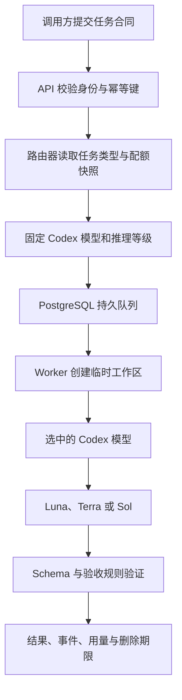

# `AIALRA Model Router` 使用指南

## 1 使用范围

本指南说明 `AIALRA Model Router` 怎样接收任务、怎样选择模型、怎样返回结果，以及本人设备和内部 `Agent` 应该选择哪个调用入口

`Responses` 兼容接口适合已有模型调用程序

`Jobs` 接口适合需要排队和追踪状态的任务

`CLI` 适合终端脚本，`TypeScript` 客户端适合应用集成

`MCP` 适合让 `Codex` 等 `Agent` 把子任务委派给路由器

仓库截图使用合成数据，不会调用真实模型；生产根路径不提供公开展示面

真实调用可以使用本地 Compose 或由 Authentik 保护的 `VPS`

两种方式都需要 `Codex` 登录、`Worker` 启动和 `API Key` 创建

## 2 任务执行流程

<div align="center">



图 2.1 从任务合同到可验证结果的执行流程

</div>

路由器在接单时只固定单个 Codex 模型和单个推理等级

Worker 首次产生输出或工具副作用后会保持原路由

这项限制可以防止同一任务在不同模型之间产生不一致结果

## 3 首次配置

### 3.1 准备受保护入口

生产入口使用 HTTPS 域名示例 `https://router.example.com`

`Nginx` 只绑定 Tailscale 接口。根路径与控制台进入 Authentik，`/api/v1` 与 `/v1` 还要求作用域 API 密钥

`VPS` 需要满足以下条件：

- `PostgreSQL`、`API` 和 `Web` 健康检查通过
- Compose 中只有一个专用 `Codex Worker` 已启动
- `Worker` 专用账户已经完成 `codex login`
- `CODEX_MAX_CONCURRENCY` 首次部署保持 `1`
- Authentik 登录、边缘证明和内部证明均通过伪造头测试

完整部署顺序见[部署指南](deployment.md)

### 3.2 创建首个管理员 `API Key`

`BOOTSTRAP_ADMIN_TOKEN` 只用于第一次创建管理员凭据

根据 [`KeysController`](../apps/api/src/keys/keys.controller.ts) 与 [`packages/security`](../packages/security/src/index.ts) 的实现，`API` 返回的明文 `API Key` 只出现一次，服务端保存 `HMAC-SHA-256` 摘要

```powershell
$RouterUrl = "https://router.example.com" # 使用实际 HTTPS 域名替换示例地址
$BootstrapToken = Read-Host "Bootstrap token" # 从安全渠道读取一次性引导令牌，避免写入命令历史
$BootstrapHeaders = @{ "X-Bootstrap-Token" = $BootstrapToken } # 只在首次管理员密钥请求中发送引导令牌
$BootstrapBody = @{ name = "Bootstrap administrator"; scopes = @("admin") } | ConvertTo-Json # 创建具有管理员作用域的首个密钥请求
$CreatedKey = Invoke-RestMethod -Method Post -Uri "$RouterUrl/api/v1/bootstrap/keys" -Headers $BootstrapHeaders -ContentType "application/json" -Body $BootstrapBody # 调用只能成功一次的引导接口
$env:MODEL_ROUTER_API_KEY = $CreatedKey.key # 把一次显示的密钥保存在当前 PowerShell 进程，关闭终端后自动清除
```

生产环境可由 Authentik 管理员在控制台创建首个 `API Key`；本地模式仍可使用一次性 Token 和 Passkey

本地 Passkey 会话当前持续 12 小时，注册和登录挑战当前持续 5 分钟

这两个数值来自 [`AuthController`](../apps/api/src/auth/auth.controller.ts)

## 4 `Responses` 兼容接口

### 4.1 适用场景

`POST /v1/responses` 适合已有 `OpenAI Responses` 调用结构的程序

首版支持文本、模型别名、推理等级、`JSON Schema`、普通响应、`Server-Sent Events` 流和用量

不支持的字段会返回 `400 unsupported_parameter`

### 4.2 `Luna` 结构化分类案例

以下请求把一个边界清楚的分类任务固定交给 `Luna`，并用 `JSON Schema` 要求结构化结果

```powershell
$RouterUrl = "https://router.example.com" # 使用部署者提供的受保护入口
$Headers = @{ # 为写请求同时准备身份凭据和幂等键
    Authorization = "Bearer $env:MODEL_ROUTER_API_KEY" # 使用具有 jobs:write 作用域的 API Key
    "Idempotency-Key" = [guid]::NewGuid().ToString() # 同一业务请求重试时复用这个值，避免重复执行
} # 完成请求头定义
$Schema = @{ # 定义最终结果必须满足的 JSON Schema
    type = "object" # 要求模型返回 JSON 对象
    properties = @{ # 声明允许出现的字段
        category = @{ type = "string"; enum = @("notice", "action", "invoice", "spam") } # 限制分类枚举
        confidence = @{ type = "number"; minimum = 0; maximum = 1 } # 把置信度限制在 0 到 1
    } # 完成字段集合定义
    required = @("category", "confidence") # 要求两个字段同时存在
    additionalProperties = $false # 拒绝 Schema 之外的字段
} # 完成 Schema 定义
$Request = @{ # 创建 Responses 兼容请求
    model = "luna" # 固定使用 Luna，便于做可重复的批量实验
    input = "请分类：服务器证书将在 3 天后到期，需要安排续期" # 使用合成任务内容
    reasoning = @{ effort = "low" } # 边界清楚的分类任务使用低推理等级
    text = @{ format = @{ type = "json_schema"; name = "message_classification"; schema = $Schema; strict = $true } } # 启用严格结构化输出
    max_output_tokens = 200 # 限制短分类结果的最大输出量
} | ConvertTo-Json -Depth 12 # 保留嵌套 Schema 的全部层级
$Response = Invoke-RestMethod -Method Post -Uri "$RouterUrl/v1/responses" -Headers $Headers -ContentType "application/json" -Body $Request # 等待任务进入终态并返回结果
$Response | Select-Object status, model, output, usage # 查看任务状态、实际模型、输出和独立用量账本
```

成功响应包含 `status`、实际 `model`、`output`、`usage` 和内部 `job_id`

`Schema` 或验收规则失败时，任务进入 `needs_review`

系统不会自动从 `Luna` 连跳到 `Terra` 或 `Sol`

### 4.3 流式响应

把请求中的 `stream` 设为 `$true` 后，服务端通过 `Server-Sent Events` 发送 `response.created`、文本增量、工具事件和最终事件

调用方需要忽略无法识别的新事件，并在收到 `[DONE]` 后关闭读取循环

`TypeScript` 流式解析实现见 [`ModelRouterClient.streamResponse`](../packages/client/src/index.ts)

## 5 原生 `Jobs` 接口

### 5.1 适用场景

`Jobs` 接口适合长任务、批量任务、审批任务和需要断线恢复的调用方

任务创建后立即获得 `job.id`，调用方可以查询状态、订阅事件或取消任务

### 5.2 `Terra` 代码审查案例

```powershell
$RouterUrl = "https://router.example.com" # 使用受保护 API 入口
$Headers = @{ # 创建带最小作用域 API Key 的请求头
    Authorization = "Bearer $env:MODEL_ROUTER_API_KEY" # API Key 至少需要 jobs:write 和 jobs:read
    "Idempotency-Key" = [guid]::NewGuid().ToString() # 网络重试时复用同一幂等键
} # 完成请求头定义
$JobRequest = @{ # 使用完整任务合同描述审查目标和边界
    task = @{ # 任务合同决定路由、安全权限和验收方式
        objective = "审查提供的合成 TypeScript 片段并返回 3 项以内的确定问题" # 提供单一明确目标
        taskKind = "review" # review 默认路由到 Terra
        requiredContext = @("输入内容不包含真实仓库路径或凭据") # 只传递执行所需上下文
        constraints = @("只报告可以由代码证明的问题", "不要修改文件") # 约束输出范围和副作用
        expectedOutput = "按严重度返回问题、证据和修复建议" # 说明合格结果的结构
        dataClassification = "internal" # 标记任务数据等级
        permissions = @{ filesystem = "read"; network = "none" } # 使用只读且无网络的安全默认权限
        deadlineMs = 120000 # 使用契约默认值对应的 120 秒期限
        model = "auto" # 让确定性路由器根据任务类型选择模型
        effort = "medium" # 日常代码审查使用中等推理等级
    } # 完成任务合同定义
    metadata = @{ source = "usage-guide" } # 添加不含敏感信息的调用来源标签
} | ConvertTo-Json -Depth 10 # 保留任务合同的嵌套结构
$Job = Invoke-RestMethod -Method Post -Uri "$RouterUrl/api/v1/jobs" -Headers $Headers -ContentType "application/json" -Body $JobRequest # 创建持久任务
$JobId = $Job.id # 保存任务标识以便查询、订阅和取消
$Status = Invoke-RestMethod -Method Get -Uri "$RouterUrl/api/v1/jobs/$JobId" -Headers @{ Authorization = $Headers.Authorization } # 查询当前状态和路由决定
$Events = Invoke-RestMethod -Method Get -Uri "$RouterUrl/api/v1/jobs/$JobId/events?after=-1" -Headers @{ Authorization = $Headers.Authorization } # 读取已经持久化的有序事件
$Status | Select-Object id, status, route, validation, usage # 查看路由、验证和用量结果
$Events.data | Select-Object sequence, type, data # 查看状态、工具、审批、验证、用量和错误事件
```

任务状态按照 `accepted → queued → running → validating` 推进

终态为 `succeeded`、`needs_review`、`failed`、`cancelled` 或 `expired`

### 5.3 批量任务

`POST /api/v1/batches` 每次接受 1 到 100 个任务，这个范围来自 [`BatchesController`](../apps/api/src/jobs/jobs.controller.ts)

系统把批次幂等键扩展为每项任务的稳定键，因此重试同一批次不会重复执行已经接收的项目

## 6 `CLI` 调用

`CLI` 适合 `PowerShell`、计划任务和本地流水线

仓库构建完成后，可以直接运行编译产物

```powershell
$env:MODEL_ROUTER_URL = "https://router.example.com" # 指向受保护 HTTPS 入口
$env:MODEL_ROUTER_API_KEY = "<在安全终端中设置的作用域密钥>" # 使用当前进程环境变量提供密钥，禁止提交到仓库
node apps/cli/dist/main.js call --task "把合成日志分为正常、警告、错误" --kind bounded --model luna --effort low # 创建一个 Luna 分类任务
node apps/cli/dist/main.js jobs --limit 20 # 查询最近 20 个任务
node apps/cli/dist/main.js quota # 读取最新 Codex 配额窗口快照
node apps/cli/dist/main.js cancel --id "<任务 UUID>" # 取消仍在排队或运行的任务
```

批量输入使用 `JSON Lines`，每行是单个 `CreateJobRequest`

严格 `JSON` 无法合法加入注释，字段定义以 [`openapi/openapi.yaml`](../openapi/openapi.yaml) 为准

## 7 `TypeScript` 客户端

`TypeScript` 客户端封装身份头、幂等键、错误结构、`Jobs`、`Responses`、事件与配额接口

客户端类型从 `OpenAPI` 生成，接口发生不兼容变化时，持续集成会检测生成文件漂移

```typescript
// 导入仓库提供的类型化客户端
import { ModelRouterClient } from "@aialra/model-router-client"; // 导入仓库提供的类型化客户端

// 创建只连接私有入口的客户端，API Key 由运行环境注入
const client = new ModelRouterClient({
  baseUrl: process.env.MODEL_ROUTER_URL!, // 使用受保护 HTTPS 地址
  apiKey: process.env.MODEL_ROUTER_API_KEY!, // 使用最小作用域 API Key
});

// 创建可追踪的 Terra 审查任务，并使用稳定幂等键防止重复执行
const job = await client.createJob(
  {
    task: {
      objective: "审查合成配置并列出确定风险", // 描述单一审查目标
      taskKind: "review", // 让自动路由选择 Terra
      model: "auto", // 使用策略版本记录路由决定
      effort: "medium", // 为日常审查分配中等推理等级
    },
    metadata: { source: "typescript-example" }, // 使用合成来源标签
  },
  crypto.randomUUID(), // 为本次业务请求生成幂等键
);

// 输出任务标识和初始状态，供后续查询与事件订阅使用
console.log(job.id, job.status); // 保存任务标识并观察初始状态
```

## 8 `Codex MCP` 委派

模型上下文协议（Model Context Protocol，MCP）让 `Codex` 把路由器当作工具使用

`Codex` 桌面应用、`CLI` 和 `IDE` 扩展会共享同一台 `Codex` 主机上的 `MCP` 配置 [1]

- 第一步，构建仓库并在当前终端设置私有入口与 `API Key`

```powershell
pnpm build # 生成 MCP 服务需要的 apps/mcp/dist/main.js
$env:MODEL_ROUTER_URL = "https://router.example.com" # 设置受保护 HTTPS 入口
$env:MODEL_ROUTER_API_KEY = "<在安全终端中设置的作用域密钥>" # 设置具有 jobs 和 quota 作用域的密钥
```

- 第二步，在受信任项目的 `.codex/config.toml` 中加入 `STDIO MCP` 配置

`env_vars` 只转发变量名对应的当前环境值，配置文件不会保存密钥 [1]

```toml
[mcp_servers.aialra-model-router] # 注册 AIALRA Model Router 本地 STDIO MCP 服务
command = "node" # 使用 Node.js 启动已构建的 MCP 服务
args = ["apps/mcp/dist/main.js"] # 从仓库根目录加载 MCP 入口
env_vars = ["MODEL_ROUTER_URL", "MODEL_ROUTER_API_KEY"] # 从 Codex 主机环境转发私有地址和密钥
required = true # MCP 初始化失败时阻止 Agent 在缺少治理工具的情况下继续
startup_timeout_sec = 10 # 使用官方默认启动等待时间
tool_timeout_sec = 150 # 由默认任务期限 120 秒加 30 秒传输余量得到
enabled_tools = ["delegate_codex", "preview_route", "job_status", "cancel_job", "quota_snapshot"] # 只启用首版实现的 5 个工具
```

- 第三步，重启 `Codex` 并使用 `/mcp` 检查 `aialra-model-router`

`Codex` 官方文档确认桌面应用、`CLI` 和 `IDE` 扩展支持 `STDIO MCP` 服务，并共享主机配置 [1]

- 第四步，向 `Sol` 或 `Terra` 提交明确委派请求，例如要求先调用 `preview_route`，再通过 `delegate_codex` 把边界清楚的分类子任务交给 `Luna`

`MCP` 服务把委派深度固定为 1，并写入 `child_can_delegate=false`

这项约束来自 [`apps/mcp`](../apps/mcp)

子任务无法继续委派，因此不会形成递归调用链

## 9 模型选择案例

<div align="center">

表 9.1 任务特征、建议通道与验证方法

| 任务特征                       | 建议通道       | 典型案例                     | 最小验证                              |
| ------------------------------ | -------------- | ---------------------------- | ------------------------------------- |
| 边界清楚、结构固定、可自动验证 | `Luna low`     | 分类、抽取、格式转换、短摘要 | `JSON Schema` 或 `contains:` 验收规则 |
| 日常编码、调试、集成和审查     | `Terra medium` | 代码审查、接口接入、失败修复 | 测试、类型检查或人工审查              |
| 高歧义、高风险或分歧裁决       | `Sol high`     | 架构选择、威胁分析、发布裁决 | 决策记录与独立复核                    |

</div>

所有任务都由 Codex Luna、Terra 或 Sol 执行

## 10 常见错误

<div align="center">

表 10.1 首次接入常见错误

| 错误码                       | 原因                                    | 处理方法                                       |
| ---------------------------- | --------------------------------------- | ---------------------------------------------- |
| `invalid_api_key`            | API Key 缺失、过期、吊销或摘要校验失败  | 创建新密钥并检查作用域与到期时间               |
| `insufficient_scope`         | API Key 缺少接口要求的作用域            | 为调用方签发最小且完整的作用域集合             |
| `idempotency_key_required`   | 写请求没有幂等键                        | 为每个业务请求创建稳定键，并在网络重试时复用   |
| `idempotency_conflict`       | 同一键值对应不同请求摘要                | 为新业务请求生成新键，保留旧键用于原请求重试   |
| `codex_capacity_constrained` | 自动 Terra 或 Sol 任务遇到 85% 配额水位 | 显式指定必要模型，或等待当前额度窗口重置       |
| `codex_capacity_reserved`    | 自动 Terra 或 Sol 任务遇到 95% 配额水位 | 仅提交必要的显式任务，或等待额度窗口重置       |
| `provider_unavailable`       | Worker 没有启用 Codex Adapter           | 检查 Codex 登录和 Adapter 开关                 |
| `needs_review`               | Schema、验收规则或审批没有通过          | 阅读验证事件并由人工决定显式重跑或修改任务合同 |

</div>

## 11 参考资料

[1] OpenAI, “Model Context Protocol,” 访问日期：2026-08-25 [在线] 可访问：[Codex MCP 配置](https://developers.openai.com/codex/mcp)
